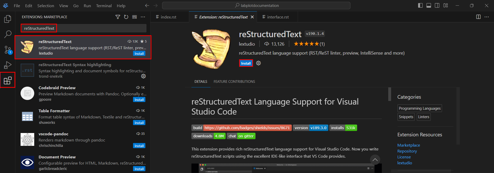
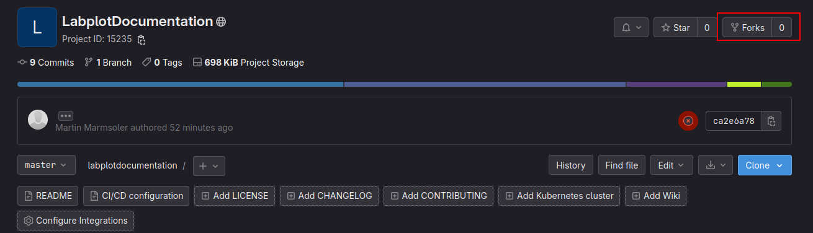

# LabPlot documentation

This repository contains the documentation for LabPlot - a FREE, open source and cross-platform Data Visualization and Analysis software accessible to everyone and trusted by professionals. Read this guide to better understand how to contribute to the documentation.

This documentation is written using `reStructuredText` and build with [Sphinx](https://www.sphinx-doc.org/en/master/#get-started). Check out their website to become familiar with it. The benefit of this sort of documentation is that multiple people can work simultaneously on the text. The text will be compiled into the final documentation afterwards.

If you have any problems, have a look into [FAQ](FAQ.md).

## Setup
This section will describe the installation process of all applications required to work with this documentation. It contains information for Linux, Windows and MacOS. If you encounter a section that is not for your OS, just skip it.

### Git
Git is a version control program used to track all changes made to the documentation. You need it to be able to download this repository (the folder with the documentation) and to modify it.

To have an clearer overview, a graphical user interface can be used to work with Git:

- Windows: [Gittyup](https://murmele.github.io/Gittyup/), [Sourcegit](https://github.com/sourcegit-scm/sourcegit), [lazygit](https://github.com/jesseduffield/lazygit)
- Linux: [Gittyup](https://flathub.org/apps/com.github.Murmele.Gittyup), [Sourcegit](https://github.com/sourcegit-scm/sourcegit), [lazygit](https://github.com/jesseduffield/lazygit)
- MacOs: [Sourcegit](https://github.com/sourcegit-scm/sourcegit), [lazygit](https://github.com/jesseduffield/lazygit)

### VSCodium
VSCodium is an extensible text editor. It is not required, but can be used to write the documentation and to display live previews of the changes without the need to compile the documentation manually all the time.

The application can be downloaded from:
- Windows: https://vscodium.com/
- Linux: https://flathub.org/apps/com.vscodium.codium
- MacOS: **TODO**

### VSCodium reStructuredText and Esbonio Plugins

The `reStructuredText` plugin for VSCodium can be used to make it easier to write the documentation. The `Esbonio` plugin enables displaying live previews of the documentation. To install these plugins, search for them in the `Extensions` section in VSCodium and then install them.

See the image below and follow the same steps for both plugins.

### Sphinx

Follow these steps to install the required Python libraries globally on your system.

- On Ubuntu:
    - `sudo apt install python3-sphinx python3-sphinx-rtd-theme`
    - `sudo apt install python3-pip`
    - `pip install sphinxcontrib-youtube breathe`
- On Fedora / RHEL: 
    - `sudo dnf install python3-sphinx python3-sphinx_rtd_theme`
    - `sudo dnf install python3-pip`
    - `pip install sphinxcontrib-youtube breathe`

If you don't want to install these libraries globally on your system, you can also install them locally in VSCodium using a `virtual environment`.

To do it, open the `Command Palette` (Ctrl+Shift+P), search for the `Python: Create Environment command`, and select it.

Then install the necessary Python packages by writing the following command in the VScode's terminal:

`pip install sphinx sphinx-rtd-theme sphinxcontrib-youtube breathe`

### Doxygen and Git

We extract our C++ SDK documentation from the LabPlot sources with doxygen. Follow these steps to install doxygen and git on your system.

- On Ubuntu:
    - `sudo apt install doxygen git`
- On Fedora / RHEL: 
    - `sudo dnf install doxygen git`

### Clone (Download) the Documentation

In order to contribute to the documentation, whether you are an active KDE member or not, you have to download the documentation first.

#### KDE member
Perform the steps below provided for a non-KDE member, except that you don't have to fork the repository.

Also, use the following SSH link to clone the repository instead of the URL link provided below:
`git@invent.kde.org:marmsoler/labplotdocumentation.git`.

#### Non-KDE member
1) Register on https://invent.kde.org
2) Fork the project (make a copy of the documentation)

3) Use Gittyup to clone (create a local copy of the repository):
- Open Gittyup.
- `File -> Clone Repository`.
- Enter the documentation URL: `https://invent.kde.org/marmsoler/labplotdocumentation.git`.
- Follow the instructions indicated in the dialog.

## Building the documentation

As mentioned before, editing of the documentation can be done in VSCodium. There is also a live preview available with the `restructuredText` and `Ebonio` plugins. So you don't have to compile manually the whole documentation each time you want to display the changes you have made.

To update the HTML version of the documentation execute the following command:

- On Windows: `make.bat html`.
- On Linux / MacOs: `make html`.

To update the HTML version of the documentation with SDK documentation execute the following command:

- On Windows: `make.bat html-sdk; make.bat html`.
- On Linux / MacOs: `make html-sdk; make html`.

The `html-sdk` rule clones the LabPlot sources into a `labplot` folder. This step is skipped if a directory or symlink named `labplot` is existing.

The generated HTML file is located in: `build/html/index.html`. Open it in your browser to see the compiled documentation.

## Update the online documentation

To publish your changes online, you have to create a merge request (to merge your changes with the changes which have been already published online). For this create a new branch (because you are not allowed to push your changes directly to the master branch).

In Gittyup just right click on the most recent commit in the commit history and select `New Branch`. Choose a name for this branch. Now you are ready to publish your changes to the world by pushing your changes upstream :)

Now, the last step is required to get your changes into the common code:
1) Go to the merge request site: https://invent.kde.org/marmsoler/labplotdocumentation/-/merge_requests.
2) Create a new merge request with the corresponding button.
3) Choose your pushed branch and continue.
4) Add a description that explains what you want to achieve with your merge request and then finally create the merge request. Now you have to wait until the continuous integration (an automated test to check that everything is fine) finishes its job. If everything is OK, the corresponding pipeline circle becomes green. However, if it is red, just check what's the problem, fix it offline and push the changes again. When everything is as expected, a maintainer of the repository will merge the code and your changes will be applied to the online version of the documentation.

### Additional note

To check if there are any issues with your local version of the documentation that need to be dealt with, you can execute the following tests on your computer.

Tests:

- On Windows: `make.bat test`.
- On Linux / MacOS: `make test`.

URL checker:

- Windows: `make.bat linkcheck`.
- Linux / MacOs: `make linkcheck`.
