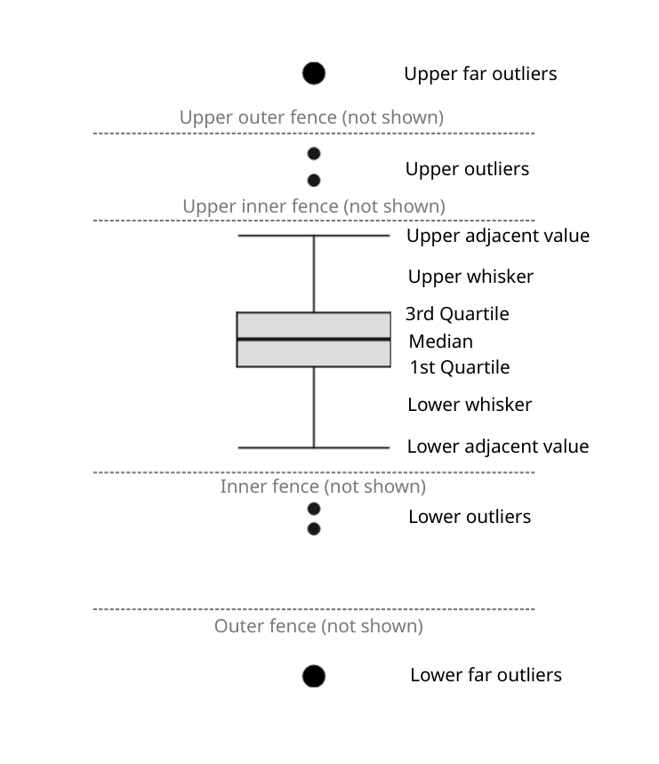
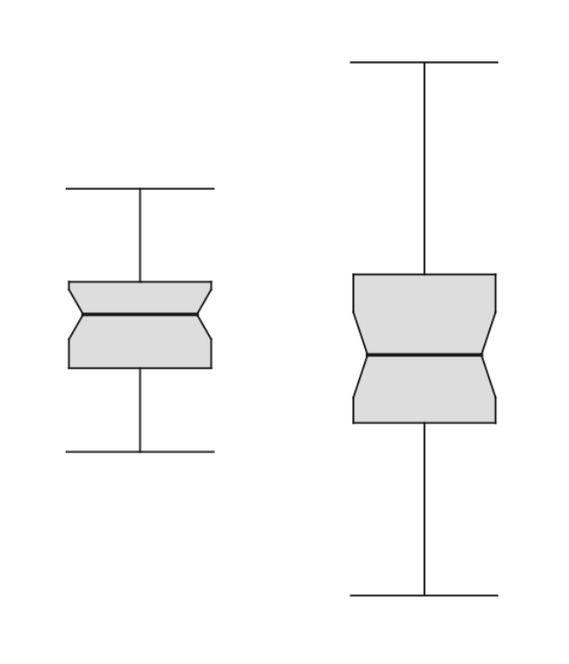
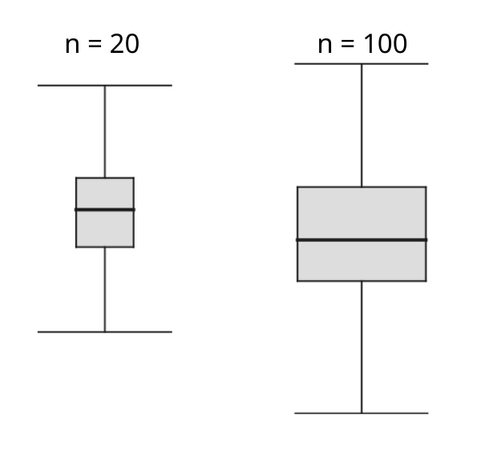
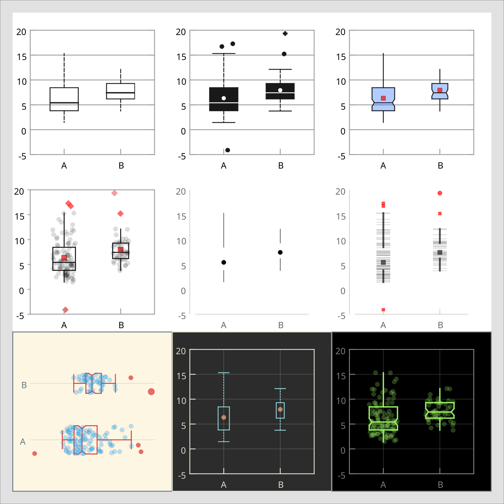

.. _2D_plotting_boxplot:

Box Plot
===================

.. contents::

How to make a box plot
--------------------------

See the video on how to make a ``box plot`` in LabPlot.

.. youtube:: bmEQbOlqKF4
   :align: left
   :width: 650px

Basic Concepts
----------------------

A ``box plot`` (also known as a ``box-and-whisker plot``) provides a quick visual summary of four important aspects of a distribution of values contained in a data set:

- *Level* - What is the central value of the data set?
- *Spread* - How much dispersed are the values?
- *Shape* - Is the data set symmetric or skewed?
- *Outliers* - Are there any unusual values?

Elements of a box plot:
~~~~~~~~~~~~~~~~~~~~~~~~~

- ``Box`` -  the upper and the lower lines of the box correspond to ``the third (Q3) and the first (Q1) quartiles`` respectively. The difference between the Q3 and the Q1 is called the `interquartile range (IQR)``. The height of the box represents the IQR.
- ``Median line`` - the line dividing the box into two parts and representing the median value of the data set.
- ``Inner fences`` (not shown by default) - the upper inner fence represents the value that is ''k'' times the IQR above the Q3 and the lower inner fence represents the value that is ''k'' times the IQR below the Q1. The default value for ''k'' is 1.5.
- ``Outer fences`` (not shown by default) - the upper outer fence represents the value that is 3 times the IQR above the Q3 and the lower outer fence represents the value that is 3 times the IQR below the Q1.
- ``Adjacent values`` - these are the outermost values on each end that are still within the corresponding inner fence.
- ``Caps`` - the lines referring to upper and lower adjacent values.
- ``Whiskers`` - the lines extending to caps, i.e. they lead from Q3 and Q1 to upper and lower adjacent values respectively.

Note that there are also other ways to define whiskers in LabPlot, namely: min/max, mean +/- 1 standard deviation, mean +/- 3 standard deviations, median +/- 1 median absolute deviation, median +/- 3 median absolute deviation, 10/90 percentiles, 5/95 percentiles and 1/99 percentiles.

Outliers
--------------

With these definitions at hand we can use a rule of thumb to attempt to label or identify and plot potential outliers:

- ``Outliers`` - the values lying beyond either inner fence and depicted by small black circles in the box plot above.
- ``Far outliers`` - the values lying beyond either outer fence and depicted by large black circles in the box plot above.

The ``1.5 x IQR`` rule is rather liberal and can be regarded as an ''outlier-labeling'' rule rather than as an identification rule. It gives early warning to deal with the assumed outliers and seems good for exploratory purposes when it is important not to miss any outliers. The ``3.0 x IQR`` rule is extremely conservative and can be considered an ''identification'' rule for outliers. As a compromise, the values of ''k'' greater or equal to 2.0 might also be used in outlier ''identification'' by means of the ''k x IQR'' rule.

Note, however, that these rules are just handy guidelines that don't necessarily substitute any knowledge and good judgment.

Jittering
---------------
Box plots are most useful for emphasizing summary statistics but convey no information about whether there are, for example, multiple peaks, gaps or clusters in the distribution. To overcome their misleading potential, all data points can be added on top of boxes, using ``jittering`` (adding random noise over the data points) to avoid over-plotting.

Furthermore, in addition to jittering, a combined visualization of histogram and box plot can be used to provide more insights. The example below shows five datasets (taken from `Same stats, different graphs <https://www.research.autodesk.com/publications/same-stats-different-graphs/>`_) having completely different distribution but leading to the same box plot visualizations:

.. figure:: images/LabPlot boxplot jitter histogram.png
    :alt:
    :align: center
    :width: 650px

Here, jittering together with histograms helps to reveal the different distributions.

Notched box plot
---------------------
Box plots, laid out side by side, allow visual comparison between different batches of data in four aspects regarding level, spread, shape and potential outliers. The ``notches`` on the sides of box plots permit a more refined comparison by providing a rough measure of the significance of differences between medians. They define a confidence interval around the median that has been adjusted to make it appropriate for comparisons of two boxes. More specifically, if the notches of two boxes do not overlap, we can be confident at roughly the 95% level (this is "strong evidence") that the two medians are different.

The height of the notch is the median +/- 1.58 x IQR/sqrt(n).

In the example above, there is no strong evidence for the difference between two medians because the notches overlap.

Be careful not to interpret the notches as defining a confidence interval of the median. They refer to ``a 95% confidence interval for the difference in the medians``. This is an `individual` 95% level—that is, no allowance is made for the number of comparisons considered.

Variable width box plot
---------------------------

We can also draw attention to the difference in size of the data sets by using ``variable width box plots``. The width of each box plot can be made proportional to the square root of the ``number of data points (n)`` contained in each data set, as shown in the example below.

Same Data, Different Boxplots
--------------------------------

The below picture acts as a showcase of what is currently possible in LabPlot.

References
-----------------

- Marsh, C. (1998). Exploring Data. An Introduction to Data Analysis for Social Scientists. Polity Press.
- Tukey, J. W. (1977). Exploratory Data Analysis. Addison-Wesley.
- McGill, R., Tukey, J. W. and Larsen, W. A. (1978). Variations of box plots. The American Statistician, 32, 12–16.
- Velleman, P. F. and Hoaglin, D. C. (1981). Applications, Basics and Computing of Exploratory Data Analysis. Duxbury Press.
- Iglewicz, B and Hoaglin, D.C. (1993). How to Detect and Handle Outliers. ASQC.
