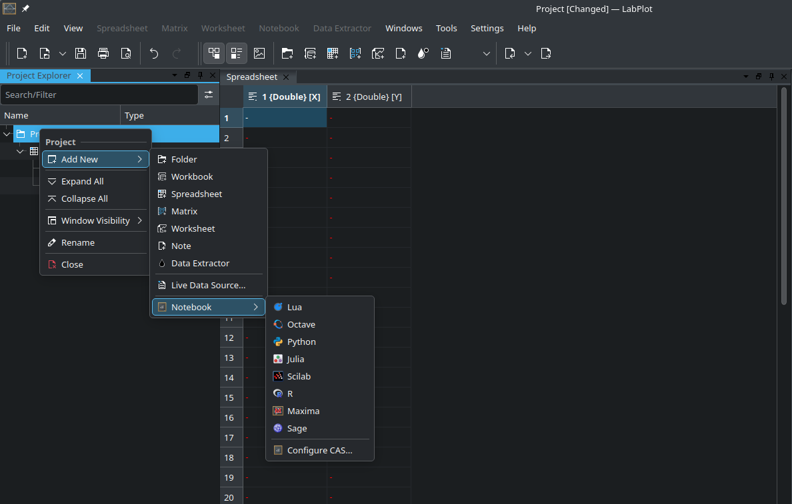
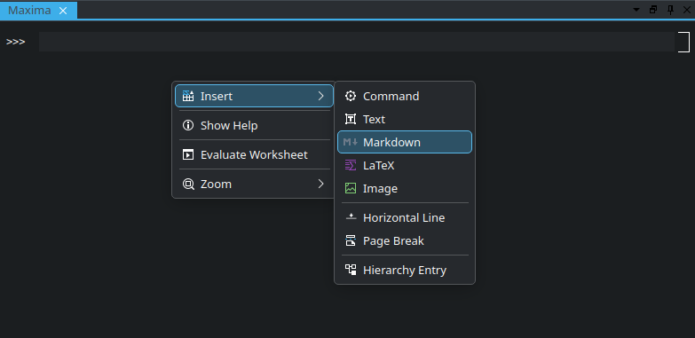
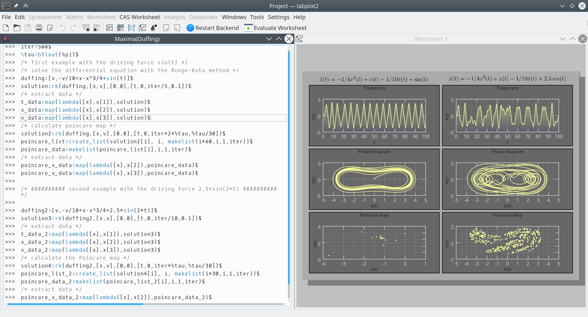
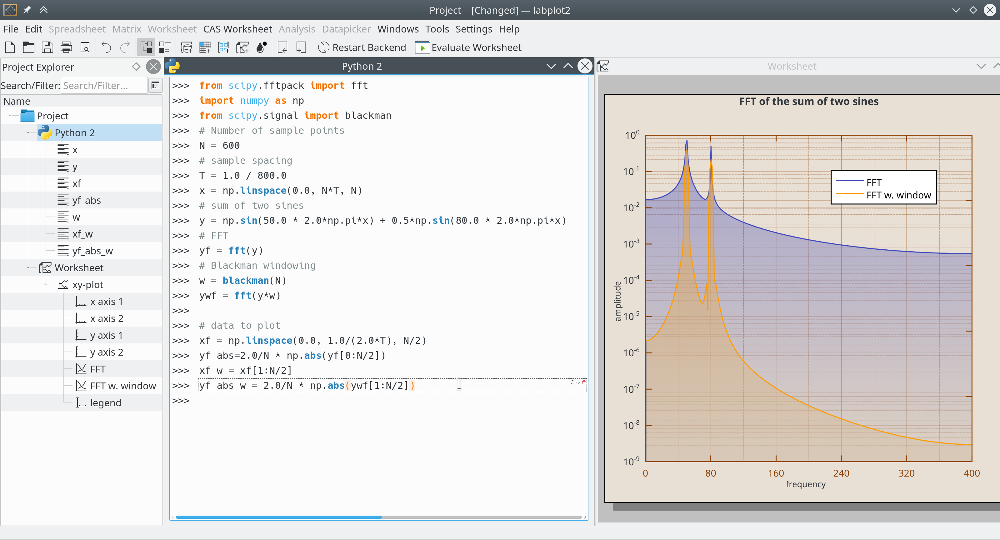

.. meta::
   :description: Description of LabPlot's Computational Notebooks
   :keywords: LabPlot, documentation, user manual, data analysis, data visualization, curve fitting, open source, free, help, learn, computational notebooks, R, Python, Julia, Maxima

.. metadata-placeholder

   :authors: - LabPlot Team

.. _computational_notebooks:

Computational Notebooks
=========================

Introduction
----------------------------------------

LabPlot's ``Computational Notebooks`` offer an interactive interface to various open-source mathematics and statistics packages as well as programming languages. These include ``Maxima``, ``Octave``, ``R``, ``Scilab``, ``Sage``, ``KAlgebra``, ``Qalculate!``, ``Python``, ``Julia``, and ``Lua``. This integration enables execution of computations and immediate visualization of results within the same environment, providing a user-friendly interface for complex calculations and data analysis.

Some of the key features are:

- **Multiple Notebooks and Languages**: multiple notebooks and different languages can be used in the same project file.
- **Extensive Editing Capabilities**
- **Syntax Highlighting**
- **Plotting Support**: the results of the visualizations are embedded directly in the notebook or shown in an external window, different output formats supported.
- **Markdown and LaTeX Syntax**: Markdown and LaTeX syntax can be utilized within the notebooks to create richly formatted text, equations, and documentation alongside their computations and visualizations.
- **Support for Jupyter and Cantor Projects**: LabPlot can read Jupyter and Cantor projects, allowing users to import and work with notebooks created in these environments.
- **Integrated Help and Documentation**: LabPlot shows the output of the integrated help system for environments that provide this feature (Maxima and R) and allows to download the product documentations and to show them directly in the project.
- **Variables as the Data Source**: LabPlot recognizes notebook variables containing array-like data (e.g., Maxima lists, Python lists and tuples, etc.) and allows to select them as sources for interactive plots and analysis functions.

As a brief introduction, see the video on how to use Computational Notebooks in LabPlot.

.. youtube:: 8lDQStVDevw
   :align: left
   :width: 650px

Prerequisites
----------------------------

To make use of the notebook interface for a specific language, it needs to be installed first. For systems like Maxima, Octave, Sage and Scilab, the communication is happening with the executable of this system and it's enough to provide its location in the application settings if it's was not determined automatically:

For R, Python and Julia the interpreter is embedded into LabPlot's process and only those versions of these languages can be used that were used on the build system during the build time of LabPlot. For which versions to use we refer to the `FAQ <https://labplot.kde.org/frequently-asked-questions/>`_

On Windows and on macOS (starting with LabPlot 2.12) all languages mentioned above are supported except of R, Lua, Julia and Qalculate!. On Linux, the support for the different languages is determined by the build and package step of the distribution in use.

Basic Concepts
---------------------

To begin, create a new notebook from the :menuselection:`Add New` menu:

On default a "command entry" is created which accepts the actual code of the used language. To execute the code, hit the button :guilabel:`Evaluate Entry` or use the shortcut :kbd:`Shift+Enter`. To create cells of a different type, select the corresponding item from the context menu:

LaTeX Typesetting
--------------------------

.. todo:: add a description

Properties Panels
--------------------------

.. todo:: add a description

General
--------------------------

.. todo:: add a description

Table of Contents
--------------------------

.. todo:: add a description

Help
--------------------------

.. todo:: add a description

Variables
--------------------------

.. todo:: add a description

Documentation
--------------------------

.. todo:: add a description

Visualization in LabPlot
--------------------------------

While it is possible to visualize the data directly in the notebooks for most of the supported systems, sometimes it is desired to visualize the results of computations that were performed in a notebook directly in LabPlot's - :ref:`worksheet`. This is useful for example when the results need to be visualized together with other data imported into LabPlot or when the more advanced and interactive styling and navigation capabilities are required.

To enable this, LabPlot recognizes the creation of variables holding array-like data and allows to select them as a data source for plots and analysis functions similarly to the columns in a - :ref:`data_containers_spreadsheet`. The currently supported data containers are:

- **Maxima** lists
- **Octave** column and row vectors
- **Python** lists, tuples, sets, NumPy arrays, columns from Pandas dataframes
- **Julia** vectors and tuples

The examples below show how powerful calculations carried out inside of different environments can be combined with the user-friendly visualization and editing capabilities of LabPlot. In the first example, a Maxima session exploring the chaotic dynamics of the Duffing oscillator is shown. The forced oscillator's differential equation is solved using Maxima, and the results are visualized using LabPlot. Plots include the oscillator's trajectory, phase space, and Poincaré map, showcasing the system's complex behavior.

In a second example, Python session analyzing the effect of Blackman windowing on the Fourier transform is shown. It demonstrates how windowing can enhance the clarity of frequency components in signal processing, with plots showing the Fourier transform before and after applying the Blackman window.

