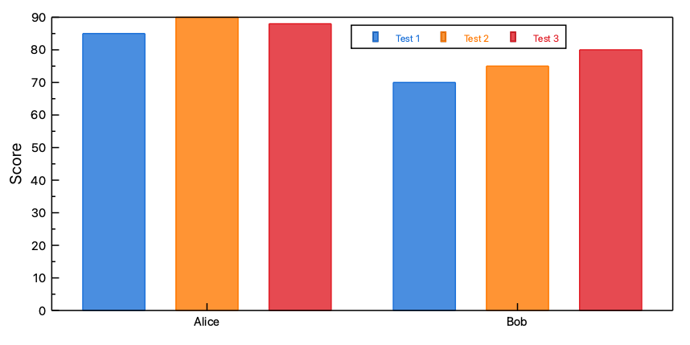
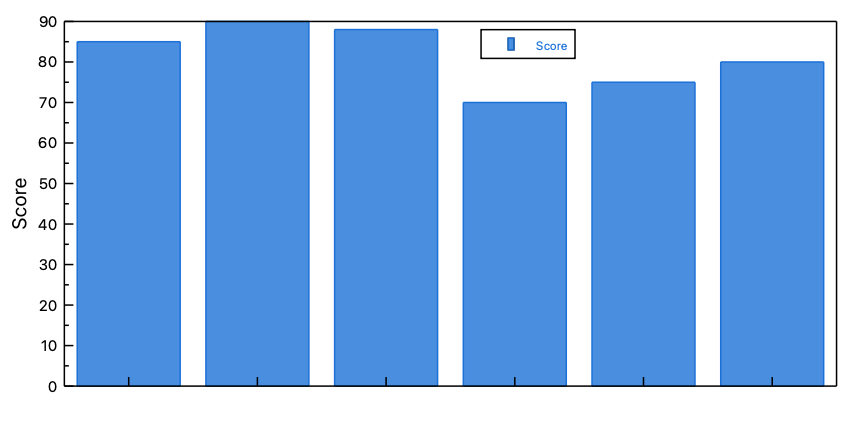

.. _data_containers_spreadsheet:

Spreadsheet
===================

.. contents::

Basic Concepts
--------------------

The :ref:`data_containers_spreadsheet` is the main part of LabPlot when working with data and consists out of columns. ``Column`` is the basic data set in LabPlot used for plotting and data analysis. Every ``column`` of the :ref:`data_containers_spreadsheet` consists of ``cells`` and is specified by its name and the type of the data:

* **Double** - floating-point numbers with double precision for decimal values (range:  ±1.79769 × 10\ :sup:`308`)
* **Integer** - whole numbers, 32-bit signed integers (range: -2,147,483,648 to 2,147,483,647)
* **Big Integer** - large whole numbers, 64-bit signed integers (range: -9,223,372,036,854,775,808 to 9,223,372,036,854,775,807)
* **Text** - alphanumeric strings and text data
* **Date & Time** - date and time values

For each type different representation formats can be assigned like decimal or scientific format for numeric columns etc. In addition to these properties it is also possible to specify the ``plot designation`` that is used in some places to to automatically recognize how to plot the data and which columns to use as X, Y, etc.

Data Structure
--------------------------
There are two commonly used ways to structure the data in the spreadsheet - the "wide" format and the "long" (or "tidy") format. In a wide format, each subject has a single row, and various attributes or time points are spread across multiple columns (e.g., time series data where each time point is a column). For tidy data, each variable is a column and each observation is a row.

For the following example in the wide format for the score obtained by students in three tests

=======  ======  ======  ======
Name     Test 1  Test 2  Test 3
=======  ======  ======  ======
Alice    85      90      88
Bob      70      75      80
=======  ======  ======  ======

"Test Number" and "Score" are the actual variables, while "Name" is an identifier. In the tidy format, the same data would be structured as follows:

=======  ===========  ======
Name     Test Number  Score
=======  ===========  ======
Alice    Test 1       85
Alice    Test 2       90
Alice    Test 3       88
Bob      Test 1       70
Bob      Test 2       75
Bob      Test 3       80
=======  ===========  ======

.. important::
   While both formats are valid and supported in LabPlot, attention needs to be paid to the way how LabPlot operates on the data - namely, for the visualization and analysis, LabPlot always operates on columns and not on rows and therefore different data formats will produce different results.

For example, visualizing the data for both formats in a Bar Plot will produce the following results:

In the first case, the visualization of the three numerical columns with the scores in a bar plot leads to a "grouped" bar plot with three bars  - each bar represents a score and each group represents a student name. In the second case, the visualization of the "Score" column (the only numerical column in the spreadhseet) leads to a bar plot with six separate bars - one bar for the score values for each combination of "Name" and "Test Number".

Import Data
-----------------

Generate Data
------------------

Column Formulas
~~~~~~~~~~~~~~~~

Columns can be populated with values calculated from formulas. The formula system supports over 600 mathematical, statistical, and scientific functions from the GNU Scientific Library (GSL).

**Quick Example:**

.. code-block:: none

   # Calculate distance from origin
   sqrt(x^2 + y^2)

   # Normalize data (z-score)
   (value - mean(value)) / stdev(value)

   # Conditional logic
   if(temperature > 0; 1; 0)

To generate values using a formula, select the target column and navigate to the section **Formula** in the Properties Explorer. Enter your expression, map variables to columns, and enable **Auto Update** for automatic recalculation on data changes in the source columns and **Auto Resize** to automatically adjust the size of the target column based on the number of rows in the source columns. The formula system supports referencing other columns in the same spreadsheet or even columns from other spreadsheets within the same project.

For detailed information about syntax, available functions, and examples, see :ref:`data_containers_spreadsheet_formulas`.

Random Values
~~~~~~~~~~~~~~

Columns can be filled with random values from 36 different statistical distributions including Gaussian (normal), uniform, exponential, Poisson, binomial, and many more.

**Common distributions:**

* **Gaussian** (μ, σ) - Normal distribution for natural phenomena
* **Uniform** (a, b) - Equal probability over a range
* **Exponential** (λ) - Waiting times between events
* **Poisson** (λ) - Count data (number of events)
* **Binomial** (p, n) - Success/failure trials

To generate random values, select one or more columns, right-click and choose **Fill with Random Values**. Configure the distribution parameters and optionally set a seed for reproducible results.

For a complete guide to all distributions, parameters, and use cases, see :ref:`data_containers_spreadsheet_random`.

Other Generation Methods
~~~~~~~~~~~~~~~~~~~~~~~~~~

In addition to formulas and random values, several utility functions are available in the **Generate Data** context menu for selected columns:

Row Numbers
^^^^^^^^^^^

Fill columns with sequential row numbers (1, 2, 3, ...). The column type is automatically set to Integer.

**Usage:** Select column(s) → Right-click → Generate Data → **Row Numbers**

**Use cases:**

* Create index columns
* Number observations sequentially
* Generate unique identifiers

Const Values
^^^^^^^^^^^^

Fill columns with a user-specified constant value. An input dialog prompts for the value based on the column type (numeric, text, etc.).

**Usage:** Select column(s) → Right-click → Generate Data → **Const Values**

**Use cases:**

* Initialize columns with default values
* Fill baseline or reference values
* Set placeholder data

Equidistant Values
^^^^^^^^^^^^^^^^^^

Generate arithmetic sequences with precise control over start, end, increment, or count. Three generation modes are available:

* **Fixed Number** - Specify start value, end value, and number of points
* **Fixed Increment** - Specify start value, increment size, and number of points
* **Fixed Number & Increment** - Specify start value, increment, and number (end value calculated)

**Usage:** Select column(s) → Right-click → Generate Data → **Equidistant Values**

**Examples:**

* Linear time axis: start=0, end=10, number=100 → [0, 0.101, 0.202, ..., 10]
* Regular intervals: start=0, increment=0.5, number=20 → [0, 0.5, 1.0, 1.5, ...]
* Custom sequence: start=5, increment=3, number=10 → [5, 8, 11, 14, ...]

Equidistant Date & Time Values
^^^^^^^^^^^^^^^^^^^^^^^^^^^^^^^

Generate date/time sequences with configurable units (years, months, days, hours, minutes, seconds, milliseconds).

**Usage:** Select column(s) → Right-click → Generate Data → **Equidistant Date & Time Values**

**Examples:**

* Daily data: 2024-01-01, increment=1 day, number=365
* Hourly logs: 2024-01-01 00:00, increment=1 hour, number=24
* Monthly reports: 2024-01-01, increment=1 month, number=12

Sample Values
^^^^^^^^^^^^^

Downsample or subsample column data using two methods:

* **Periodic** - Take every N-th value (e.g., every 10th point)
* **Random** - Select random subset based on uniform distribution

**Usage:** Select column(s) → Right-click → Generate Data → **Sample Values**

**Use cases:**

* Reduce data density for plotting
* Extract representative subset
* Downsample high-frequency measurements

.. note::
   Sampling creates new columns with the sampled data; original columns remain unchanged.

Flatten Columns
^^^^^^^^^^^^^^^

Combine multiple columns into a single column by stacking values vertically. Optionally include reference columns that are repeated for each flattened value (useful for converting wide format to long/tidy format).

**Usage:** Select columns to flatten → Right-click → Generate Data → **Flatten Columns**

**Example:** Converting wide to long format:

.. code-block:: none

   # Wide format (2 columns):
   Name     Score
   Alice    85
   Bob      90

   # Select Score columns from multiple tests
   # Add "Name" as reference column
   # Result (long format):
   Name     Score
   Alice    85
   Alice    90
   Bob      85
   Bob      90

**Use cases:**

* Convert wide format to tidy/long format for analysis
* Combine multiple measurement columns
* Prepare data for grouped visualization

Manipulate Data
------------------

LabPlot provides comprehensive tools for transforming and cleaning column data through the **Manipulate Data** context menu. All operations support undo/redo and work on multiple columns simultaneously.

**Main categories:**

* **Arithmetic Operations** - Add, subtract, multiply, divide by values or statistical measures

  * Add/subtract custom values, mean, median, min, max
  * Advanced baseline subtraction using arPLS algorithm
  * Multiply/divide for unit conversions and scaling

* **Data Filtering** - Drop or mask values based on criteria

  * **Drop Values** - Permanently remove values (outliers, invalid data)
  * **Mask Values** - Temporarily exclude from plots and analysis (preserves original data)

* **Normalization** (15 methods) - Scale data for comparison

  * Basic: Divide by sum, min, max, count
  * Central tendency: Divide by mean, median, mode
  * Spread: Divide by range, SD, MAD, IQR
  * Standardization: Z-scores (SD, MAD, IQR)
  * Rescale to arbitrary interval [a, b]

* **Transformations** - Tukey's Ladder of Powers

  * x³, x², √x, log(x), 1/√x, 1/x, 1/x² - improve normality, stabilize variance

* **Data Reordering** - Reverse column order

**Usage:** Select column(s) → Right-click → **Manipulate Data** → Choose operation

For detailed information about all operations, parameters, and use cases, see :ref:`data_containers_spreadsheet_manipulate`.

Mask Data
~~~~~~~~~~~~~~

Sometimes it is required to ignore some data points in the visualization or when performing some data analysis like fitting etc. To exclude some data points from plotting and data analysis without deleting them, ``masking`` of those data points can be used. You can mask the selected data points in the :ref:`data_containers_spreadsheet` (:menuselection:`Selection` / :menuselection:`Mask Selection` from the :ref:`data_containers_spreadsheet` cell context menu).

In the example below a ``fit`` was performed to the original data containing some obvious measurement errors and a fit where those outliers were masked.

.. .. todo:: add a screenshot with two fits

.. note::
   Masking can also be done based on value criteria using **Manipulate Data → Mask Values**. See :ref:`data_containers_spreadsheet_manipulate` for details.

.. Baseline Subtraction (Correction)
.. ~~~~~~~~~~~~~~~~~~~~~~~~~~~~~~~~~~~~~~~~~~

Keyboard Shortcuts
--------------------

The spreadsheet supports the following keyboard shortcuts for efficient data manipulation:

Editing Operations
~~~~~~~~~~~~~~~~~~~

====================================    ========================================
Key/Mouse Event                         Function
====================================    ========================================
:kbd:`Ctrl+C`                           Copy selected cells
:kbd:`Ctrl+V`                           Paste into selected cells
:kbd:`Ctrl+X`                           Cut selected cells
:kbd:`Del` or :kbd:`Backspace`          Clear content of selected cells
:kbd:`Insert`                           Insert column (if column selected) or row
====================================    ========================================

Navigation and Selection
~~~~~~~~~~~~~~~~~~~~~~~~~

====================================    ========================================
Key/Mouse Event                         Function
====================================    ========================================
:kbd:`Ctrl+A`                           Select all cells
:kbd:`Return` or :kbd:`Enter`           Move to next row in same column
====================================    ========================================

Search and Replace
~~~~~~~~~~~~~~~~~~~

====================================    ========================================
Key/Mouse Event                         Function
====================================    ========================================
:kbd:`Ctrl+F`                           Open search dialog
:kbd:`Ctrl+H`                           Open search and replace dialog
:kbd:`Escape`                           Close search/replace dialog
====================================    ========================================

View Operations
~~~~~~~~~~~~~~~~

====================================    ========================================
Key/Mouse Event                         Function
====================================    ========================================
:kbd:`Ctrl++` or :kbd:`Ctrl+=`          Zoom in
:kbd:`Ctrl+-`                           Zoom out
:kbd:`Ctrl+0`                           Reset zoom to 100%
:kbd:`Ctrl+Mouse Wheel`                 Zoom in/out
====================================    ========================================

Data Analysis and Visualization
-----------------------------------

Statistics
-----------------------------------

Column Statistics
~~~~~~~~~~~~~~~~~~~~~~~~~~~~

Column Statistics Spreadsheet
~~~~~~~~~~~~~~~~~~~~~~~~~~~~~~
