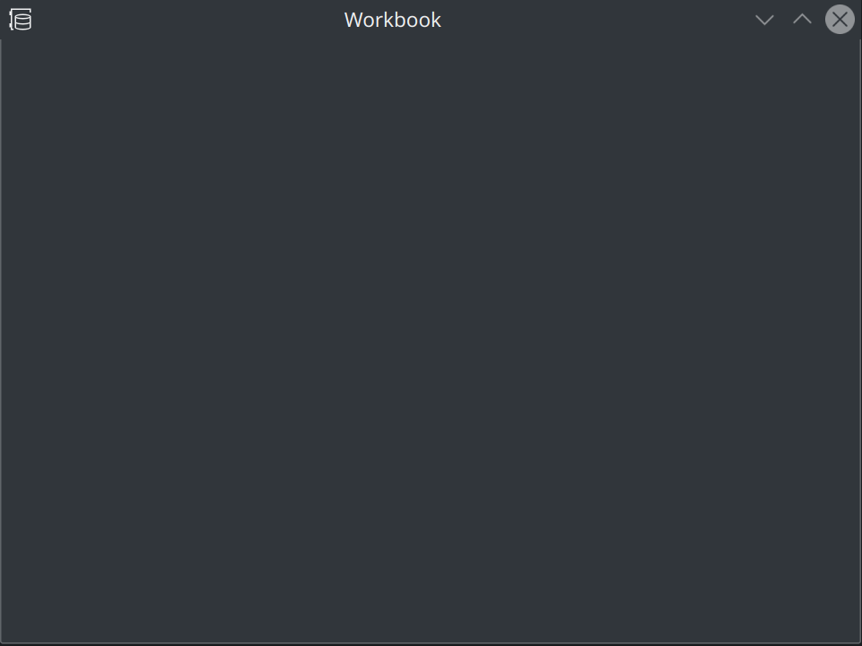
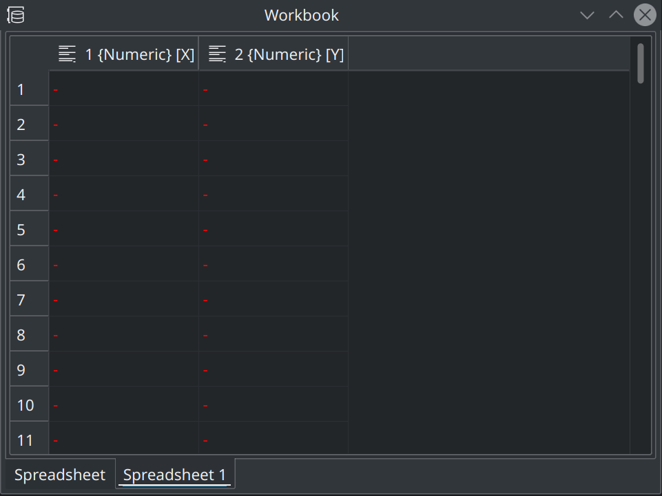
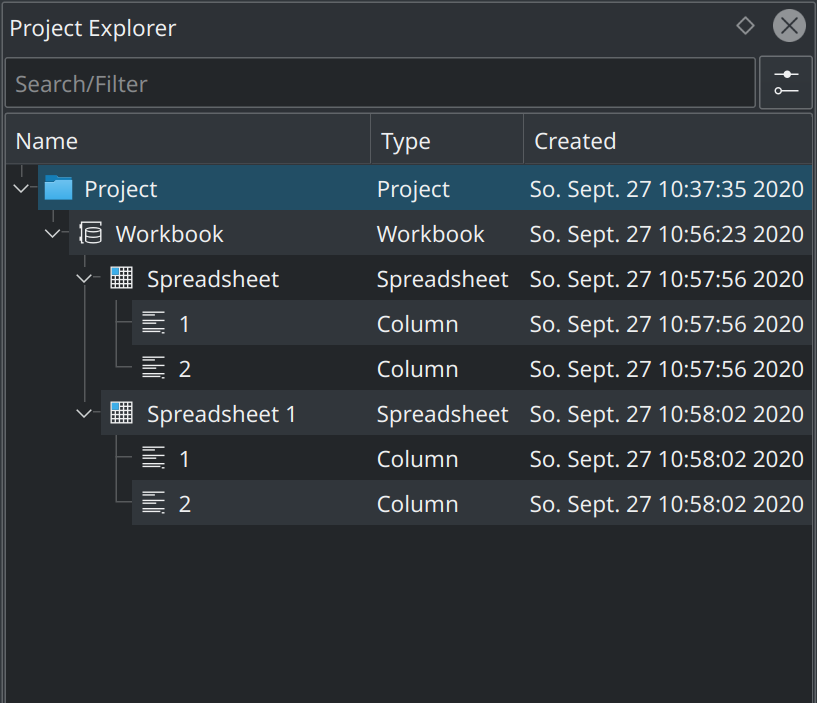

.. _data_containers_workbook:

Workbook
===================

.. contents::

Basic Concepts
-----------------

With :ref:`Folder <folders>` it is already possible to bring some structure in the :ref:`Folder <folders>` and to group together several related objects (spreadsheets with data stemming from text files of similar origin, red, green and blue values of an image imported into three different matrices, etc.). With :ref:`data_containers_workbook` the user has the possibility for another additional grouping.

:ref:`data_containers_workbook` helps the user to better organize and to group different data containers (:ref:`data_containers_spreadsheet` and :ref:`data_containers_matrix`). This object serves as the parent container for multiple Spreadsheet- and/or Matrix-objects and puts them together in a view with multiple tabs.

Add Data Containers
-----------------------
A new :ref:`data_containers_workbook` is created via the :menuselection:`Add New` menu from the main menu bar or from the context menu of the project explorer. Upon creation, an empty workbook is created.

and the actual data containers like :ref:`data_containers_spreadsheet` or :ref:`data_containers_matrix` are added by the user on demand like in the example below showing a :ref:`data_containers_workbook` with two spreadsheets added:

:ref:`data_containers` added to the :ref:`data_containers_workbook` are shown as child entries in the :ref:`interface_project_explorer` and the user can navigate between them directly in the :ref:`interface_project_explorer`:

