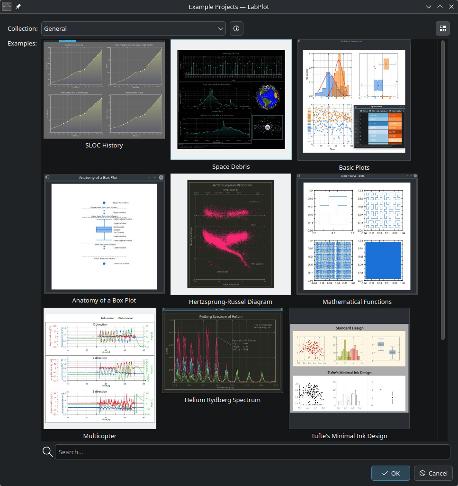

.. _example_projects:

Example Projects
==================

LabPlot comes with a set of example projects that demonstrate various features and capabilities of the software. These projects can serve as a starting point for your own work or as a learning resource to understand how to utilize different functionalities within LabPlot.
To open an example project, navigate to `File → Open Example` from the main menu. This will open a dialog with a list of available example projects:

These examples are grouped into collections based on their content and purpose:

 - General: Basic plots, data analysis, and visualization techniques.
 - Analysis: Examples focusing on data analysis methods like fitting, FFT, etc.
 - Statistics: Examples demonstrating statistical analysis and visualization.
 - Computing: Examples showcasing computational notebooks and scripting capabilities.

Select the desired project and click `Ok` to load it into LabPlot.
