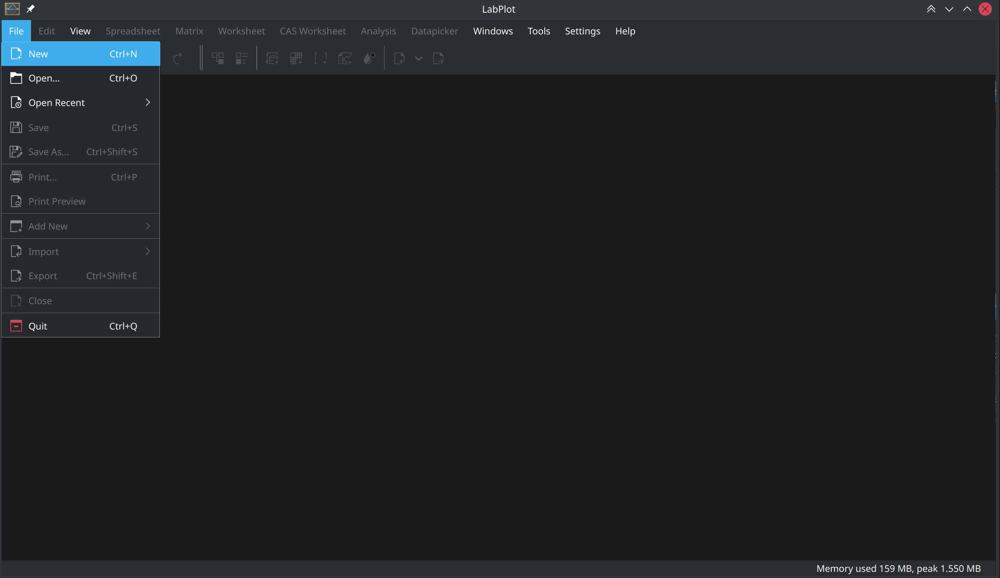

.. _quick_start:

Quick Start
===========

Import and visualization of data with LabPlot can be done in 5 easy steps.

.. contents::

.. youtube:: Ngf1g3S5C0A
   :align: left
   :width: 650px

Create a new project
----------------------

The first step is to create a new project by selecting :menuselection:`File --> New` from the main menu, if it is not created already.

This and many other common actions can be invoked from the main menu, a context menu, a toolbar button, or even via a keyboard shortcut.

After the new project is created, you'll see ``Project Explorer`` on the left, showing the structure of the project, and also ``Properties Explorer`` on the right, showing the properties of the object currently selected in the ``Project Explorer``.

The project is still empty and we're now going to add some content to it.

Create a new spreadsheet
------------------------

Import data
--------------

Visualize data
--------------

Export results
--------------
