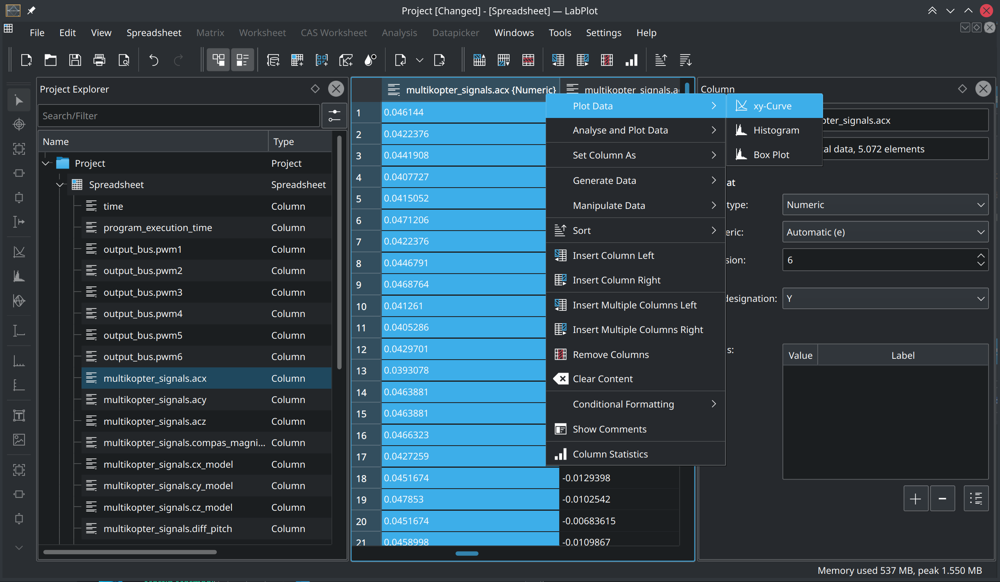

.. _quick_start:

Quick Start
===========

Import and visualization of data with LabPlot can be done in 5 easy steps.

.. contents::

.. youtube:: Ngf1g3S5C0A
   :align: left
   :width: 650px

Create a new project
----------------------

The first step is to create a new project by selecting :menuselection:`File --> New` from the main menu, if it is not created already. In current versions of LabPlot, a new project is opened by default when you start the program.

This and many other common actions can be invoked from the main menu, a context menu, a toolbar button, or even via a keyboard shortcut.

After the new project is created, you'll see ``Project Explorer`` on the left, showing the structure of the project, and also ``Properties Explorer`` on the right, showing the properties of the object currently selected in the ``Project Explorer``.

The project is still empty and we're now going to add some content to it.

Create a new spreadsheet
------------------------

The data in LabPlot is organized and stored in ``Data Containers``. In this particular example, we're dealing with data organized in columns (one column per variable), so a ``Spreadsheet`` is the appropriate data container to import such data into.

To create a new ``Spreadsheet``, choose :menuselection:`Add New --> Spreadsheet` from the context menu in the ``Project Explorer``.

A new ``Spreadsheet`` will be created with the default settings.

Now we are ready to import the data into this new ``Spreadsheet``.

Import data
------------------

To import the data from a file, choose :menuselection:`Import --> Import From File` from the main menu.

In the `Import Data` dialog box that will appear, specify the location of the file to be imported and other relevant settings (e.g. the separating characters).

Navigate to the `Preview` tab in this dialog box to check whether the structure of the data will be properly read with the current settings.

Click the :guilabel:`OK` button to import the data into the ``Spreadsheet``. After the import, you'll see it in the ``Spreadsheet``.

Visualize data
----------------

The imported data contains signals from multiple sensors that were placed on a multicopter. We want to visualize the acceleration in the x-direction. For this we select the column containing the data we want to plot and choose :menuselection:`Plot Data --> xy-curve` from the context menu of this column.

The `Plot Spreadsheet Data` dialog box will appear.

LabPlot automatically assigned the "Time" column to the X-axis. We keep all the other settings as shown below in order to visualize the data in a new ``plot`` on a new ``Worksheet``.

Once the ``plot`` is created, you can change its appearance by clicking on it or on one of its identifiable parts and then modifying their properties in the ``Properties Explorer``.

Export results
------------------

To export the ``plot`` as an image, choose :menuselection:`Export` from the main menu and specify the location of the output file and other relevant settings:

