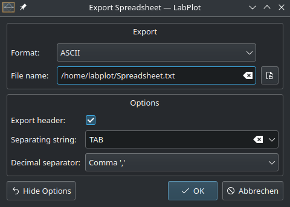
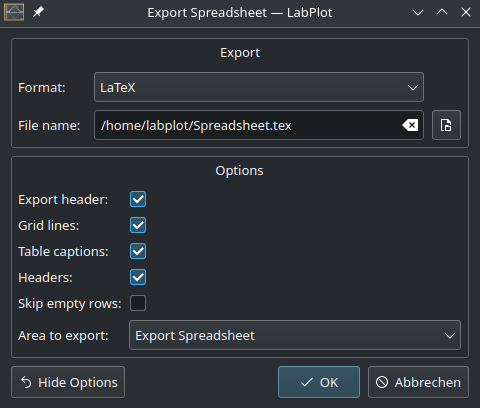
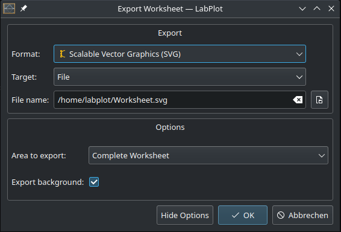

.. _import_export_export:

Export data
=============

It's possible to export the data in :ref:`data_containers_spreadsheet`, :ref:`data_containers_matrix` and the results of the visualization in :ref:`worksheet` to multiple data formats. The export is triggered via the corresponding action in the main toolbar, in the main menu or via object's context menu. There are multiple options available for the supported formats.

Spreadsheet and Matrix
----------------------------

Supported formats for :ref:`data_containers_spreadsheet` and :ref:`data_containers_matrix`:

- ASCII
- LaTeX
- FITS
- SQLite

When exporting the data to an ASCII file, the user can specify the ``column separator`` (point, comma, tab, etc.) and the ``decimal point separator`` for numerical data (point or comma) as well as whether the header needs to be exported or not:

When exporting a spreadsheet to ``LaTeX``, a complete LaTeX file with a table environment is created and can be directly compiled. The appearance of the table can be controlled by several options and the user can specify the area to export (whole spreadsheet or the current selection only):

Worksheet
----------------

Supported formats for :ref:`worksheet`:

- PDF
- SVG
- PNG
- JPEG
- BMP
- PPM
- XBM
- XPM

:ref:`worksheet` can be exported either to a file or to the clipboard. For raster graphics, the DPI number can be provided:

Export publication-quality plots from LabPlot
-----------------------------------------------

See the video on how to **export publication-quality plots** from LabPlot.

.. youtube:: GDZT-40J_RE
   :align: left
   :width: 650px
