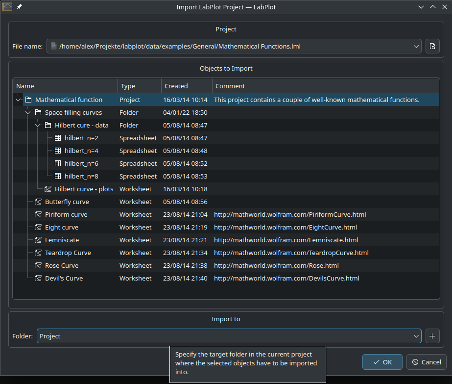
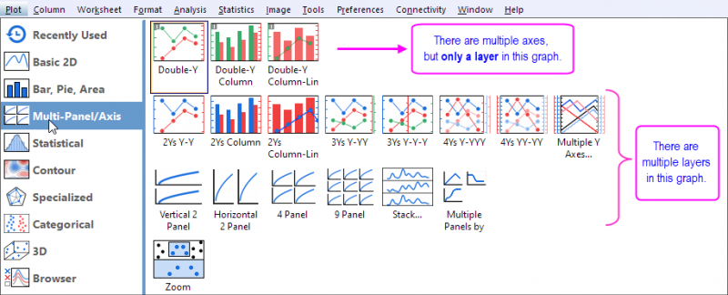
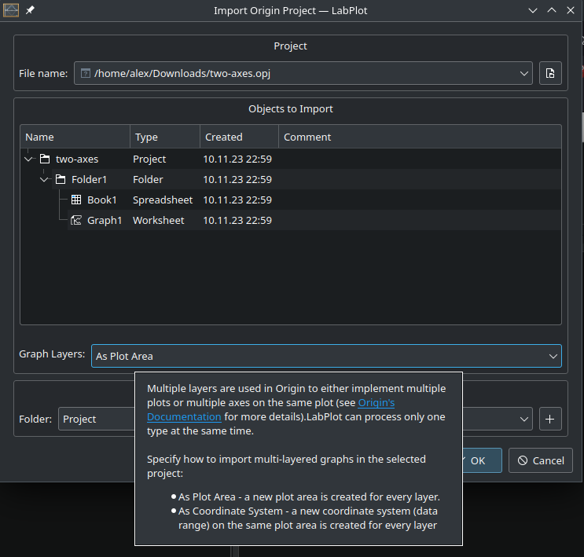

.. _import_export_labplot_origin:

Import LabPlot and Origin Projects
===================================

Unlike importing data from external files or databases, importing from project files allows you to import entire project artefacts such as data containers, visualisations, etc. into the project that is currently open in LabPlot. This is useful if only a part of another project (e.g. the spreadsheets with the data) is needed, or if the results of another project need to be merged into the current project.

Currently only import from LabPlot native and Origin projects is supported.

Import LabPlot Project Files
-------------------------------

When the ``Import Project`` dialog opens, the structure of the selected project is displayed and the user can select which objects to import:

The dependencies between the different objects are properly tracked and **the dependent objects are automatically selected** if not already done. For example, when selecting a worksheet with multiple visualizations, the dependent spreadsheets that serve as the data source for the visualizations are automatically selected and ready for import.

The user can specify the target folder where to import into which can be the top-level project folder or one of its sub-folders.

Import Origin Project Files
-----------------------------
Importing from ``Origin`` files is similar to importing from LabPlot projects, except that only **a subset of objects in Origin are supported** and can be imported into LabPlot. Also, given the different philosophies and UX of the two applications, the usual problems with an undocumented and closed source proprietary file format, and the different feature sets implemented in LabPlot and Origin, such an import is neither perfect nor complete, but we try to achieve the best possible results. `The gallery of imported Origin files <https://invent.kde.org/education/labplot/-/wikis/Import/OPJ>`_ contains multiple examples which show the quality of the results after the import.

.. todo:: Import the gallery of imported Origin files into this manual.

**The current list of supported objects**:

- Folder
- Workbook
- Spreadsheet
- Matrix
- Note
- Graph
- Line plot, scatter plot, etc.
- Bar plot
- Box plot
- Histogram

Since the terminology and the structure of objects, especially for worksheet elements, is different in many cases, **the names and the properties are mapped to those available in LabPlot**. For example, for a Graph in Origin we create a Worksheet in Labplot, for a Line Plot we create an XY-Curve, etc.

An additional note of caution must be paid to the '''multi-layers in Origin''', which are used to implement either multiple plots or multiple axes on the same plot. The following picture `Origin's documentation <https://www.originlab.com/doc/Origin-Help/MultiLayer-Graph>`_ summarizes the situation:

This logic is implemented differently in LabPlot and in order to be able to properly import the multi-layers correctly in both variations mentioned above, we introduce an additional parameter in the "Import Project" dialog to allow the user to control how the multi-layers are to be imported:

To handle Origin projects where both variants are used at the same time, the user must import the different objects separately using the appropriate import setting for them.
