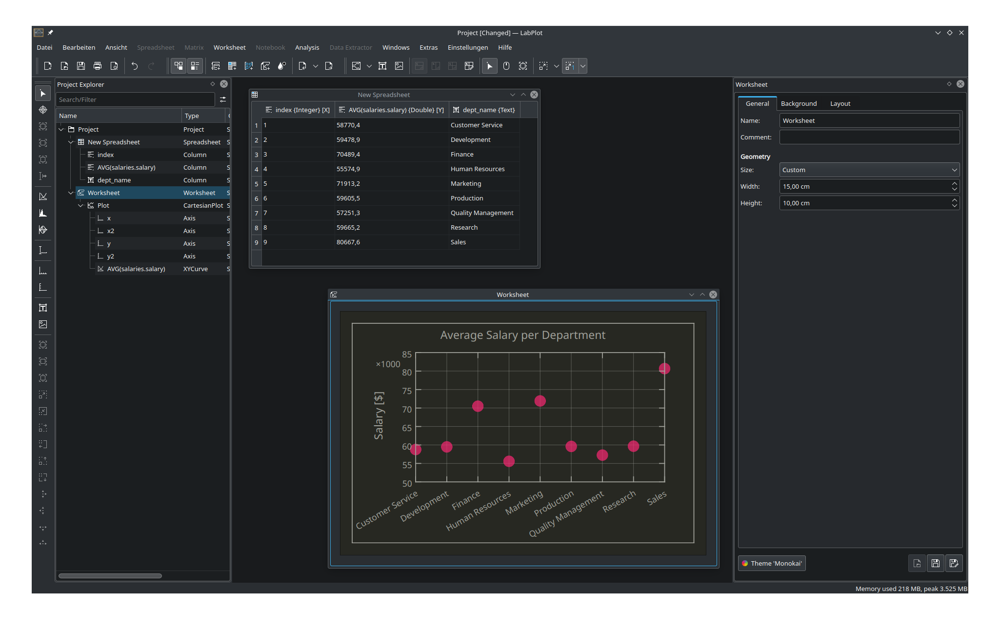

.. _import_export_sql:

Import from SQL databases
==========================

LabPlot can read and import data from SQL databases. The supported databases are those that are covered by `Qt SQL <http://doc.qt.io/qt-5/sql-driver.html>`_.

Similar to the import from files, there is a dialog for importing from databases that guides the user through the process of selection and import of the relevant data.

When opening this dialog for the first time, it's empty and the first step is to configure the connection to the database by clicking on the button :guilabel:`Manage connection` (red-highlighted on the screenshot above).

In the ``Connection Manager`` dialog select the proper database driver and provide the relevant settings like the host, the port number, the credentials and the actual name of the database on the server:

In case the SQLite database is used, the connection is simply the path to the database file:

After all the connections settings were specified, click on the :guilabel:`Test` button to make sure LabPlot can connect successfully to the database:

Note, once a connection is configured and saved, the user can select it in the import dialog for future imports and there is no need to go through the configuration steps again. Also, it is possible to manage multiple connections to different databases.

The dialog supports the user with the navigation through the available tables in the database and with a preview of the table data:

Furthermore, it is also possible to import the result of a custom SQL query and import its result set. Provide the SQL query and click on the :guilabel:`Refresh` button in the preview section of the import dialog to execute the query and to preview its result:

Once the selection of the relevant data is finalized, specify the data container to import into and click on the :guilabel:`OK` button. After the import is done, the data is ready to be used. In the example below, the result of the query calculating the average salaries per departments based on the test data from `Employees <https://github.com/datacharmer/test_db>`_ was visualized after the import:

Example: Import from SQL databases
----------------------------------

See the video on how to **import data from SQL databases** in LabPlot.

.. youtube:: nntP1okY0zg
   :align: left
   :width: 650px
