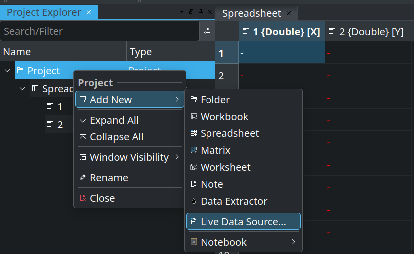
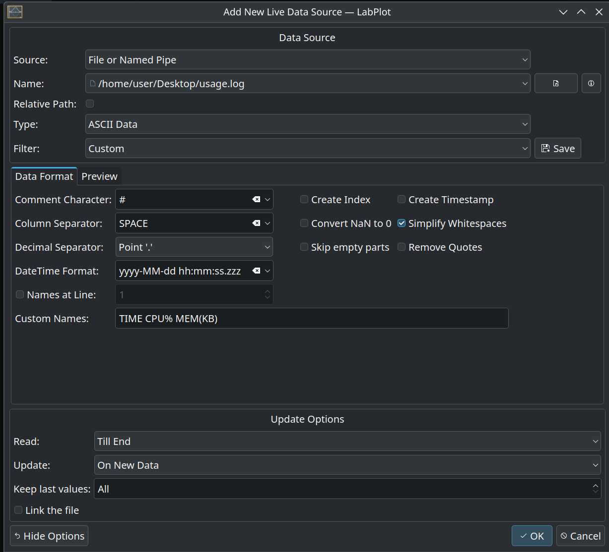
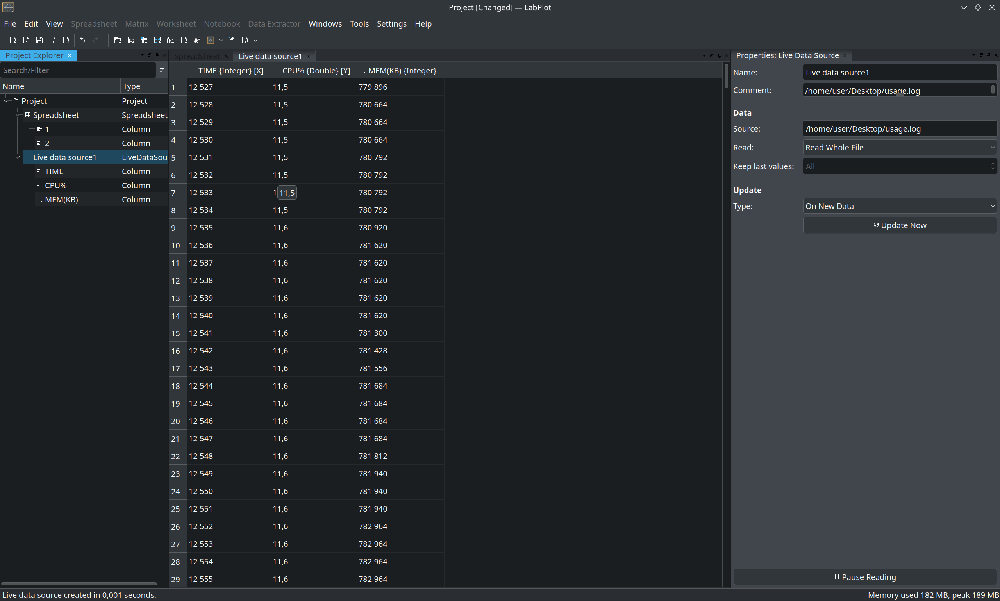

.. _import_live_data:

Import Live Data
===================

Basic Concepts
-----------------

LabPlot supports the import of ``Live Data`` (also known as ``Real-Time Data``) from various sources. The current list of supported real-time data streams:

- ``File or Named Pipe`` (a special file that is used to transfer data between unrelated processes).
- ``Network TCP Socket`` (an endpoint for communication using the Transmission Control Protocol).
- ``Network UDP Socket`` (a communication endpoint for sending and receiving data without establishing a connection).
- ``Local Socket`` (used for communication between processes on the same machine).
- ``Serial Port`` ( a communication interface that transfers data sequentially, one bit at a time, between devices).

Import Live Data From File or Pipe
-------------------------------------

To import live data from a file or a named pipe, first select :menuselection:`Project --> Add New --> Live Data Source` in the context menu for the project in the :ref:`interface_project_explorer`:

.. note::
   For other sources of Live Data, you must enter the appropriate information for the source. For example, for the ``TCP Socket`` source, you must specify a **Hostname** name and a **Port** number, while for the ``Serial Port`` source you must specify a **Port** number and the **Baud rate** ( the rate at which information is transferred in a communication channel).

Then specify in the dialog box the location of the file to be imported and other relevant settings (e.g. the separating characters).

You can also select the type of data. The following data types are currently supported:

- ASCII
- Binary data
- ROOT (CERN)
- Spice

Then go to the :menuselection:`Update Options` in the dialog and choose how to read the data:

- ``Continously Fixed`` - fixed amount of samples if processed from the beginning of the newly received data.
- ``From End`` - fixed amount of samples is processed starting from the end of the newly received data.
- ``Till End`` - all newly received data is processed.
- ``Whole File`` - on every read the whole file is re-read completely and processed. Only available for ``File or Named Pipe`` data sources.

and how frequently to update the data in the application:

- ``Periodically`` - a data source is read periodically with a user specified interval.
- ``On New Data`` - a data source is read when new data arrives.

In the field ``Keep last values`` you can specify how many samples should be stored in memory after reading. Use ``All`` if all data should be stored.

If you select the option ``Link the file``, that is available at the bottom part of the dialog, only the link to the file will be stored in LabPlot but not its content.

Once the live data is being imported, you can still change the import settings in the :ref:`interface_properties_explorer` on the right. Among other things, you can use an option to stop and resume reading the data stream that is available at the bottom of the :ref:`interface_properties_explorer`.

.. note::
   In the next step, you can make a plot of the imported data (go to the :ref:`2D_plotting` section to read more), which will be updated in real time, and use the available :ref:`data_analysis` tools.
