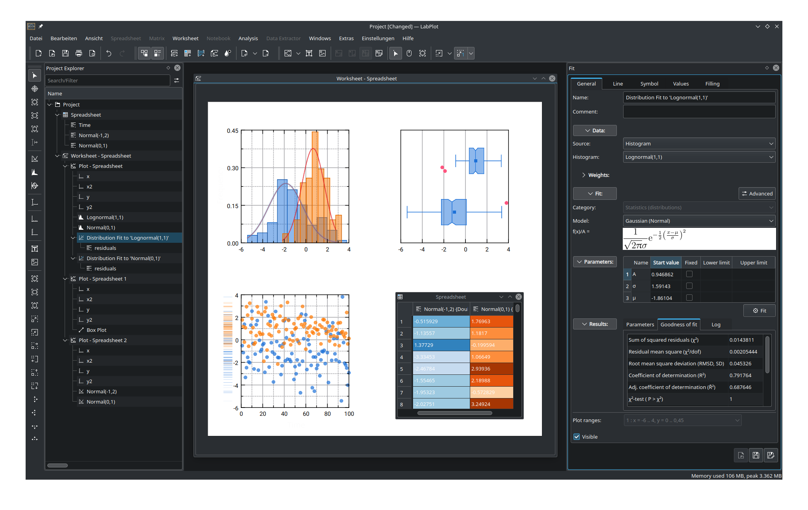

.. Labplot documentation master file, created by
   sphinx-quickstart on Thu May 25 17:07:05 2023.
   You can adapt this file completely to your liking, but it should at least
   contain the root `toctree` directive.

.. This is a comment and is not visible in the documentation.

.. meta::
   :description: The LabPlot User Manual
   :keywords: LabPlot, documentation, user manual, data analysis, data visualization, curve fitting, open source, free, help, learn

.. metadata-placeholder

   :authors: - LabPlot Team

   :license: see Credits and License page for details (https://docs.digikam.org/en/credits_license.html)

Welcome to Labplot's documentation!
===================================

.. toctree::
   :maxdepth: 2
   :caption: Contents:

.. Indices and tables
.. ==================

.. * :ref:`genindex`
.. * :ref:`modindex`
.. * :ref:`search`

###############
Getting Started
###############

.. target defines a link to the next section. So when clicking on the image
.. you will be redirected to that page

    Do Your First Steps in Labplot

.. Example how to link a video from peer tube
.. There is also a possibility to link to youtube videos
.. ..  peertube:: 46d6ac9c-5298-4124-b003-0053d3e253ef
   :width: 640
   :height: 480
   :instance: tube.kockatoo.org

..  youtube:: _oNtu49wPFs

.. container:: toctile

    .. container:: tile no-descr

        :ref:`application_intro`

    .. container:: tile no-descr

        :ref:`application_install`

    .. container:: tile no-descr

        :ref:`quick_start`

.. toctree::
   :maxdepth: 2
   :hidden:
   :glob:

   getting_started/getting_started

###############
Interface
###############

.. container:: toctile

    .. container:: tile no-descr

        :ref:`interface_mainarea`

    .. container:: tile no-descr

        :ref:`interface_project_explorer`

    .. container:: tile no-descr

        :ref:`interface_properties_explorer`

.. toctree::
    :maxdepth: 2
    :hidden:
    :glob:

    interface/interface

############
Contribution
############

Do you have experience in labplot and would like to contribute wether to the documentation or even extending the functionality of labplot? Check out the following chapters

.. container:: toctile

    .. container:: tile no-descr

        :ref:`contribution_documentation`

    .. container:: tile no-descr

        :ref:`contribution_programming`

.. toctree::
    :maxdepth: 2
    :hidden:

    contribution/contribution

###################
Credits and License
###################

Copyrights and Notices for This Document

.. container:: toctile

    .. container:: tile no-descr

        :ref:`credits_license`

.. toctree::
   :maxdepth: 2
   :hidden:

   credits_license
