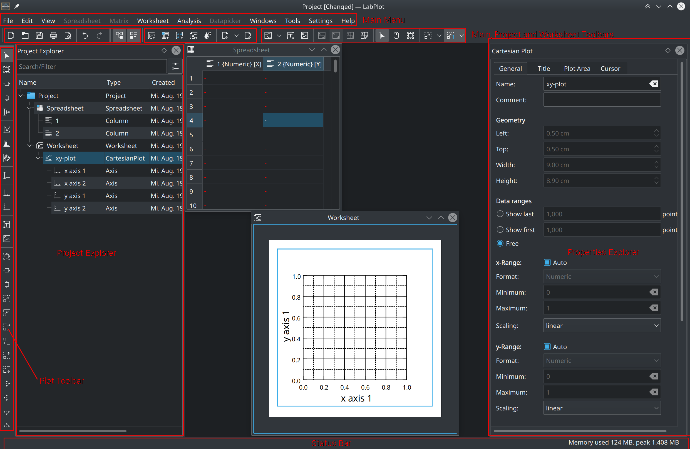
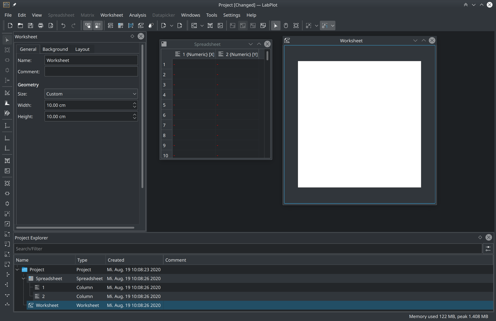
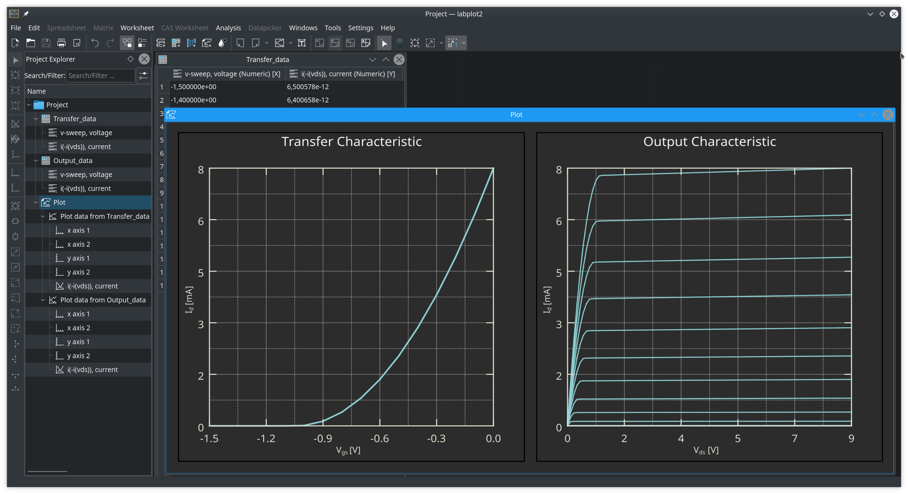

.. meta::
   :description: A description of LabPlot's interface
   :keywords: LabPlot, documentation, user manual, data analysis, data visualization, curve fitting, open source, free, help, learn, interface, GUI

.. metadata-placeholder

   :authors: - LabPlot Team

   :license: see Credits and License page for details (https://docs.digikam.org/en/credits_license.html)

.. _interface:

Interface
===================

    A description of LabPlot's interface.

.. toctree::
   :maxdepth: 2
   :caption: Contents:
   :glob:

   interface/interface_mainarea
   interface/interface_project_explorer
   interface/interface_properties_explorer

Basic Concepts
-----------------------

The interface of LabPlot follows the `MDI (multiple document interface) <https://en.wikipedia.org/wiki/Multiple-document_interface>`_ paradigm. In this approach, multiple child windows reside under a single parent window. The child windows can be either freely moved, minimized and maximized inside of the parent window or are arranged in a tabbed view (also called `tabbed document interface <https://en.wikipedia.org/wiki/Tab_(interface)>`_) - more on this in the section :ref:`interface_mainarea`.

Child windows represent the main objects in LabPlot like :ref:`data_containers_spreadsheet`, `Worksheet`, etc. These main objects on the other hand serve as containers for other objects like columns in the :ref:`data_containers_spreadsheet` or plots in the `worksheet`, etc. All these objects are organized in parent-child relations to each other and all together build up the "project".

Main Components
--------------------

Besides the usual GUI components like the main `menu bar`, the `tool bars` and the `status bar`, the main window of the application consists out of three main components:
* :ref:`interface_project_explorer`
* :ref:`interface_mainarea`
* :ref:`interface_properties_explorer`

:ref:`interface_project_explorer` and :ref:`interface_properties_explorer` are the so-called `dock widgets` and their positions inside the main window can be freely changed. The screenshot below shows a different arrangement of the dock widgets where the :ref:`interface_project_explorer` was put to the bottom of the main window and the :ref:`interface_properties_explorer` was placed on the right hand side:

Also, the dock widgets can be hidden in case more place is required in the main window for other content. Changing of the visibility (show/hide) of the :ref:`interface_project_explorer` and :ref:`interface_properties_explorer` is done via the actions in the main `tool bar`.

As an example for this, the screenshot below shows the main window with the :ref:`interface_properties_explorer` being hidden so there is more space for the visualization of the imported data:

