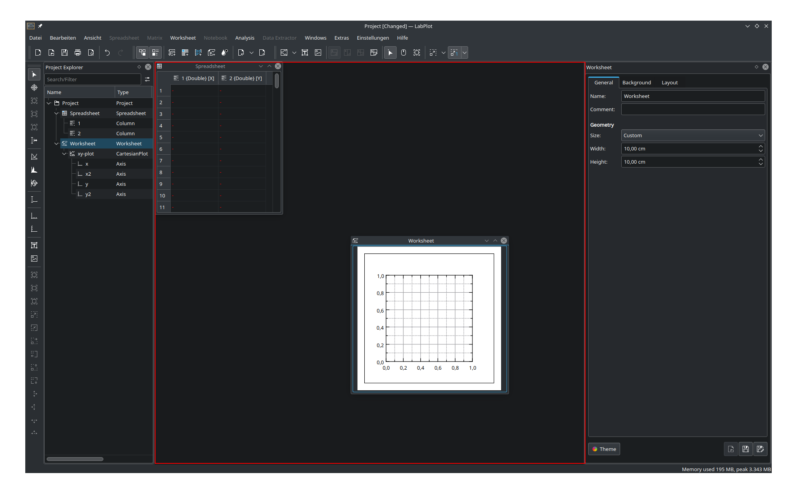
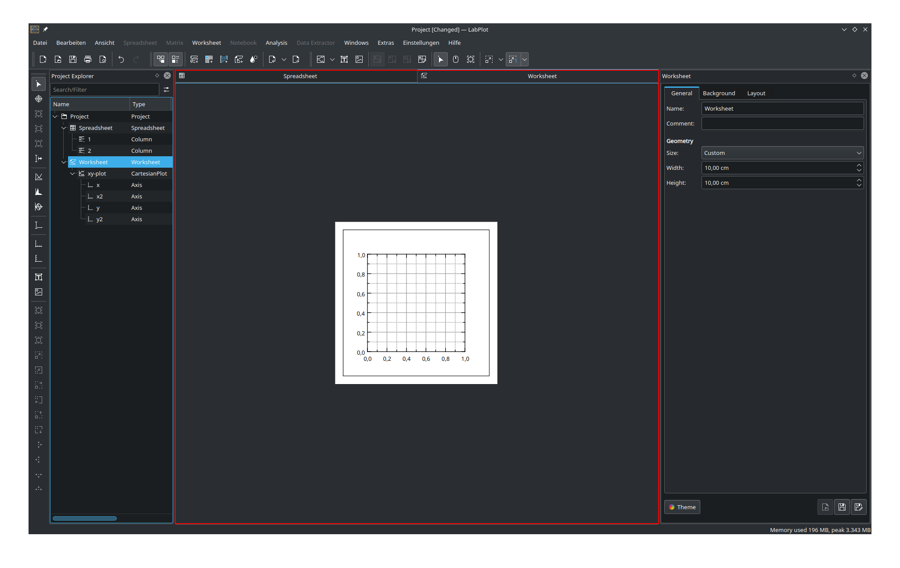
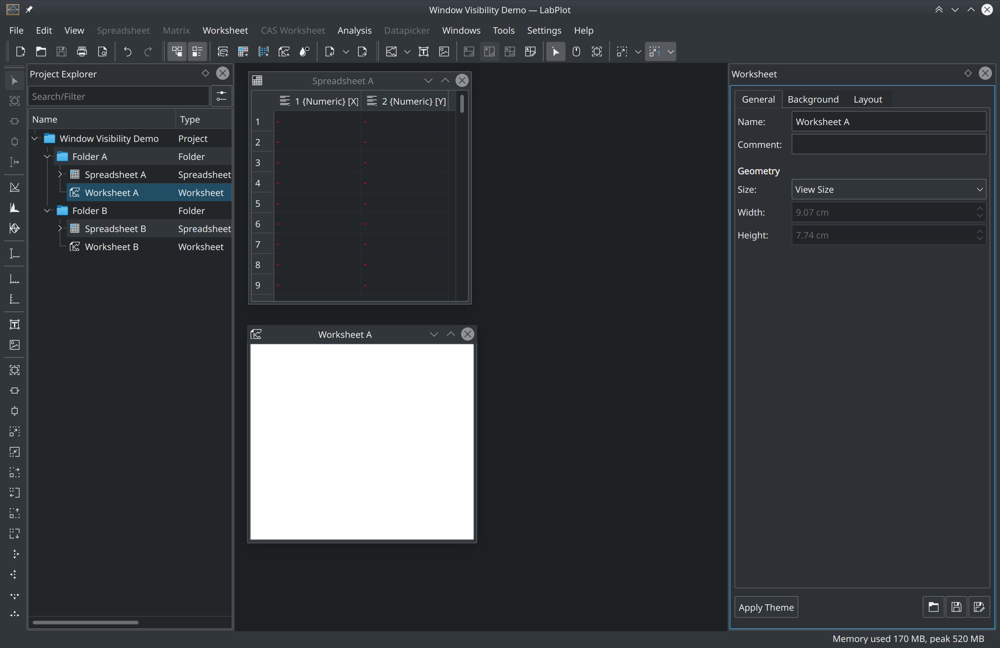
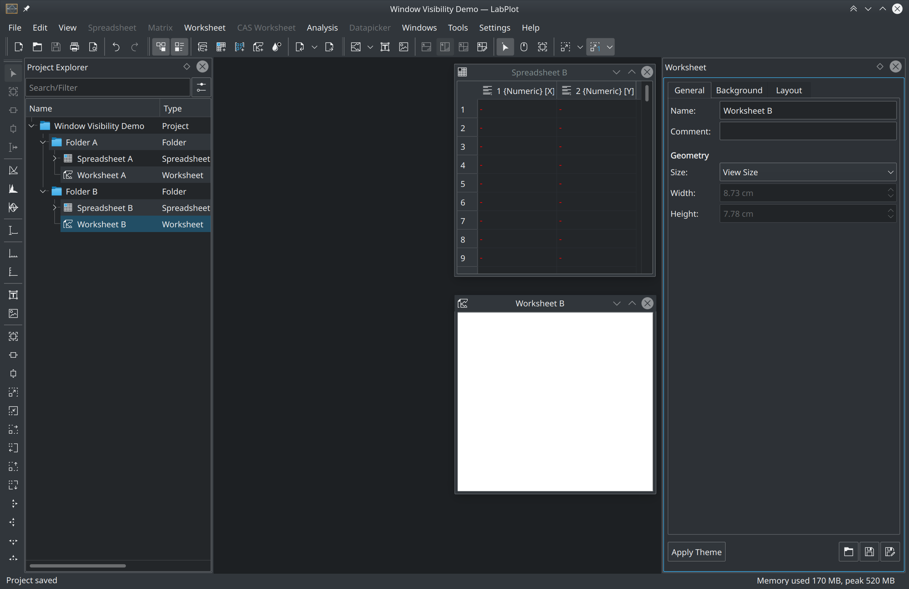
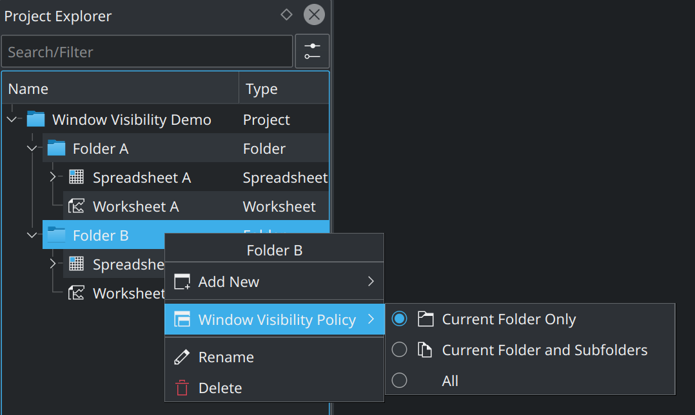
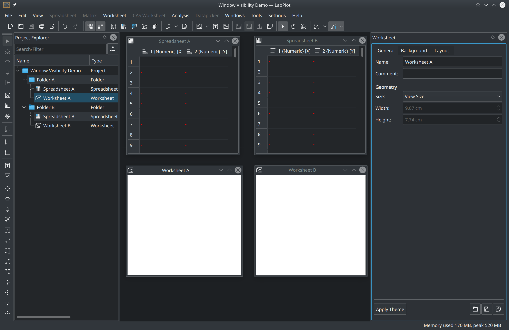

.. _interface_mainarea:

Main Area
===================

.. contents::

Basic Concepts
-----------------

:ref:`interface_mainarea` is the part of the application where the project object windows are shown. These windows represent the view of the different top-level project objects like :ref:`data_containers_spreadsheet`, `Worksheet`, etc. The child windows can be freely moved, minimized and maximized inside of the :ref:`interface_mainarea` as shown on the screenshot above.

Alternatively, the windows can also be arranged in a tabbed view like on the following screenshot:

This behavior is controlled by the option "Interface" in the application settings.

Window Visibility
-------------------

Folders can be used to structure the project as described :ref:`interface_project_explorer`. Furthermore, to avoid cluttering of the main area with windows from many objects, LabPlot shows the windows for objects from the current folder only. The content shown in the main area is adjusted when switching between the different folders - the windows from the previously selected folder are hidden and the windows for the new current folder are shown.

In case also the windows from other folders have to be shown, the ``window visibility policy`` has to be adjusted. This is achieved via the context menu of the :ref:`interface_project_explorer`.

where one of the three following options can be selected:

* :guilabel:`Current Folder Only` - shows the windows for the current folder only
* :guilabel:`Current Folder and Subfolders` - shows the windows for the current folder and its sub-folders
* :guilabel:`All` - shows all windows

E.g., by selecting the option :guilabel:`All` all windows opened by the user in all folders will be shown. The screenshot below demonstrates this behavior - the user has opened the spreadsheet and the worksheet from the first folder and the worksheet from the second folder and all these objects are visible at the same time independent of the currently selected folder in the :ref:`interface_project_explorer`:

