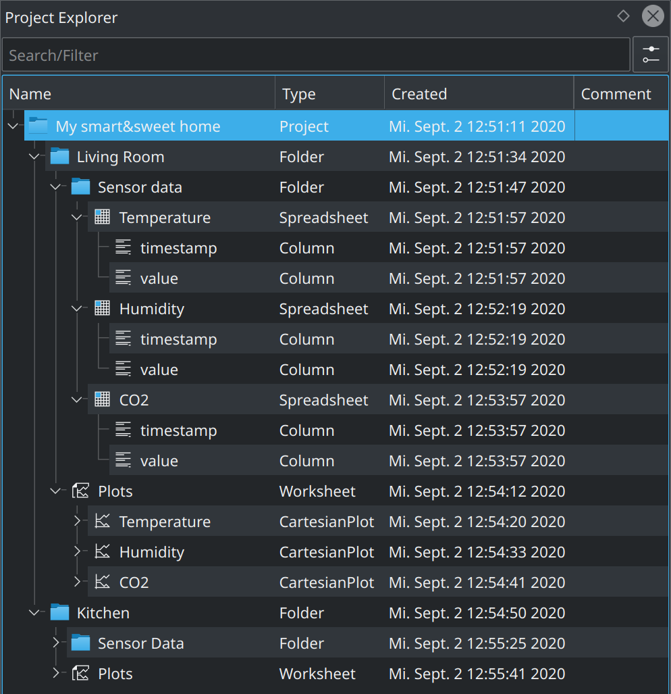

.. _interface_project_explorer:

Project Explorer
===================

.. contents::

Basic Concepts
-------------------

:ref:`interface_project_explorer` is the component in LabPlot visualizing the structure of the project. This structure is a parent-child hierarchy with the nodes in this hierarchy being the different project entities. The root node in this hierarchy stands for the project itself.

New objects are added to the project via the :mouse :menuselection:`Add New` menu in the main `menu bar`, via the corresponding actions in the `toolbar`, or via the `context menu` in the :ref:`interface_project_explorer`. After a new object was added, a new node for it appears in the :ref:`interface_project_explorer` Upon the selection of an object in the :ref:`interface_project_explorer`, its view or the view of the next parent having a view is shown in the main area.

On default, there are four columns in the :ref:`interface_project_explorer` showing the name of the object, its type (:ref:`data_containers_spreadsheet`, `Worksheet`, etc.), the creation date, and additional comment that can be provided for every object:

The default behavior can be changed and the user can define which columns to show. Via the `context menu` of the header in the tree view the selection of which columns to show can be done.

The example below shows the same project structure as in the previous example, but only with object names and comments shown:

.. _folders:

Folders
-------------

The parent-child hierarchy mentioned above can be further structured with the help of folders. Similar to the concept of folders known from file systems, a ``folder`` in LabPlot serves as a parent container where other objects can be placed under.

In the beginning, there is only one folder available in the project - the root folder representing the project itself. New folders are created similarly to other new objects via the `context menu` of the :ref:`interface_project_explorer`, etc. The screenshot below shows an example of how a project can be structured using folders:

Search and Filter
---------------------

The :ref:`interface_project_explorer` provides basic search capabilities. By starting typing in the ``Search/Filter`` text field the content shown in the :ref:`interface_project_explorer` is limited to those objects only where the names are matching the current search string. Furthermore, with the option `Case Sensitive` and `Match Whole Word` the user can control the search behavior.

Drag&Drop
------------

``Drag&drop`` within the :ref:`interface_project_explorer` is possible. Because of the specific semantic meaning behind the different project objects, the source and the destination for such a drag&drop process cannot be arbitrary. The supported workflows are:

* Move/reparent a top-level object (`Folder`, :ref:`data_containers_spreadsheet`, `Worksheet`, etc.) - drag a top-level object and drop it on another folder
* Move :ref:`data_containers_spreadsheet` or :ref:`data_containers_matrix` into :ref:`data_containers_workbook` - drag a spreadsheet or a matrix  and drop it onto a workbook
* Quick plotting of the data - drag a spreadsheet column and drop it on an already existing plot

.. youtube:: Yw5Hivcp2y8
   :align: left
   :width: 650px
