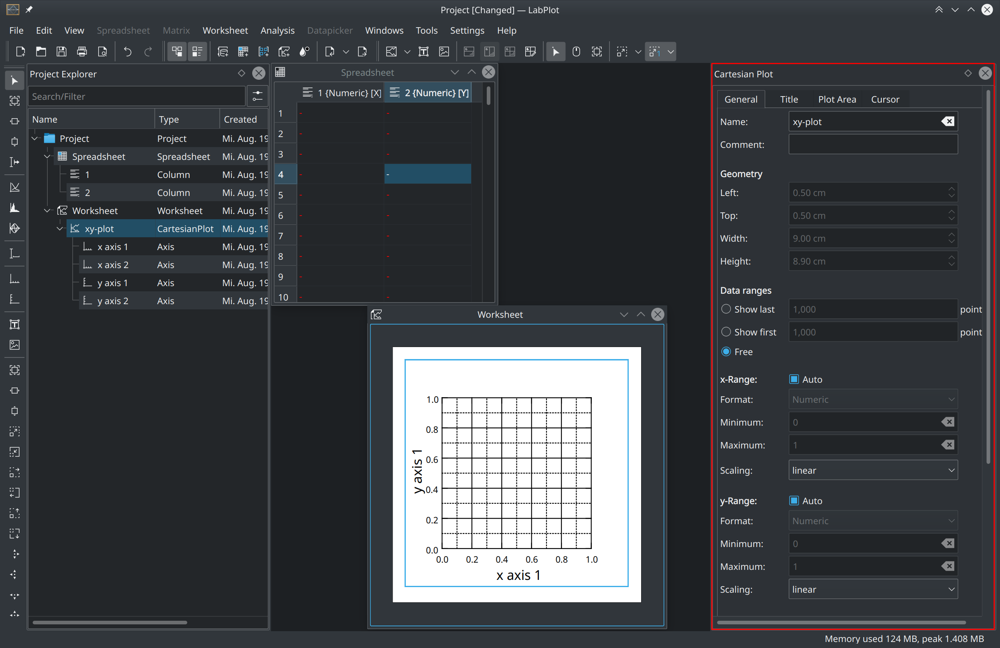

.. _interface_properties_explorer:

Properties Explorer
===================

.. contents::

Properties Explorer
--------------------

:ref:`interface_properties_explorer` allows the user to modify the properties of the currently selected object in the :ref:`interface_project_explorer`.
