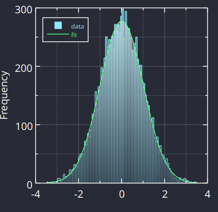

.. meta::
   :description: A description of LabPlot's SDK.
   :keywords: LabPlot, documentation, user manual, data analysis, data visualization, curve fitting, open source, free, help, learn, c++, cpp, sdk
   :authors: - LabPlot Team

.. _sdk:

SDK
===================

The objective of LabPlot's Software Development Kit (SDK) is to enable the utilization of LabPlot's core functionalities in external projects. This SDK can be employed to integrate LabPlot's algorithms into one's own projects or to automate tasks such as batch importing multiple files, processing and visualizing them, and exporting them as vector graphics. The SDK comprises a shared library (wrappers for Python later) and this documentation.

Note, this part of LabPlot is still considered experimental. Consequently, there is no assurance regarding the stability of the API or the ABI at present.

Below is a small demo to get an impression about what is possible showing how to import a text file, how to visualize the imported data in a histogram, how to perform a distribution fit and how to export the final result to PDF:

.. .. tabs::

..    .. code-tab:: c++

..       #include <QApplication>

..       #include <labplot.h>

..       int main(int argc, char** argv) {
..          QApplication app(argc, argv);

..          // create a spreadsheet and import the data into it
..          auto* spreadsheet = new Spreadsheet(QStringLiteral("data"));
..          AsciiFilter filter;
..          filter.readDataFromFile(QStringLiteral("data.txt"), spreadsheet);

..          // create a worksheet
..          auto* worksheet = new Worksheet(QStringLiteral("worksheet"));

..          // create a plot area and add it to the worksheet
..          auto* plotArea = new CartesianPlot(QStringLiteral("plot area"));
..          plotArea->setType(CartesianPlot::Type::FourAxes);
..          plotArea->addLegend();
..          worksheet->addChild(plotArea);

..          // create a histogram for the imported data and add it to the plot area
..          auto* histogram = new Histogram(QStringLiteral("histogram"));
..          histogram->setNormalization(Histogram::Normalization::ProbabilityDensity);
..          histogram->setDataColumn(spreadsheet->column(0));
..          plotArea->addChild(histogram);

..          // perform a fit to the raw data and show it
..          auto* fitCurve = new XYFitCurve(QStringLiteral("fit"));
..          fitCurve->setDataSourceType(XYAnalysisCurve::DataSourceType::Histogram);
..          fitCurve->setDataSourceHistogram(histogram);
..          plotArea->addChild(fitCurve);

..          // initialize the fit
..          auto fitData = fitCurve->fitData();
..          fitData.modelCategory = nsl_fit_model_distribution;
..          fitData.modelType = nsl_sf_stats_gaussian;
..          fitData.algorithm = nsl_fit_algorithm_ml; // ML distribution fit
..          XYFitCurve::initFitData(fitData);
..          fitCurve->setFitData(fitData);

..          // perform the actual fit
..          fitCurve->recalculate();

..          // apply the theme "Dracula"
..          worksheet->setTheme(QStringLiteral("Dracula"));

..          // export the worksheet to PDF
..          worksheet->exportToFile(QStringLiteral("result.pdf"), Worksheet::ExportFormat::PDF);
..       }

..    .. code-tab:: py

..       # TO-DO: coming soon

.. code-block:: cpp

      #include <QApplication>

      #include <labplot.h>

      int main(int argc, char** argv) {
         QApplication app(argc, argv);

         // create a spreadsheet and import the data into it
         auto* spreadsheet = new Spreadsheet(QStringLiteral("data"));
         AsciiFilter filter;
         filter.readDataFromFile(QStringLiteral("data.txt"), spreadsheet);

         // create a worksheet
         auto* worksheet = new Worksheet(QStringLiteral("worksheet"));

         // create a plot area and add it to the worksheet
         auto* plotArea = new CartesianPlot(QStringLiteral("plot area"));
         plotArea->setType(CartesianPlot::Type::FourAxes);
         plotArea->addLegend();
         worksheet->addChild(plotArea);

         // create a histogram for the imported data and add it to the plot area
         auto* histogram = new Histogram(QStringLiteral("histogram"));
         histogram->setNormalization(Histogram::Normalization::ProbabilityDensity);
         histogram->setDataColumn(spreadsheet->column(0));
         plotArea->addChild(histogram);

         // perform a fit to the raw data and show it
         auto* fitCurve = new XYFitCurve(QStringLiteral("fit"));
         fitCurve->setDataSourceType(XYAnalysisCurve::DataSourceType::Histogram);
         fitCurve->setDataSourceHistogram(histogram);
         plotArea->addChild(fitCurve);

         // initialize the fit
         auto fitData = fitCurve->fitData();
         fitData.modelCategory = nsl_fit_model_distribution;
         fitData.modelType = nsl_sf_stats_gaussian;
         fitData.algorithm = nsl_fit_algorithm_ml; // ML distribution fit
         XYFitCurve::initFitData(fitData);
         fitCurve->setFitData(fitData);

         // perform the actual fit
         fitCurve->recalculate();

         // apply the theme "Dracula"
         worksheet->setTheme(QStringLiteral("Dracula"));

         // export the worksheet to PDF
         worksheet->exportToFile(QStringLiteral("result.pdf"), Worksheet::ExportFormat::PDF);
      }

For details on the installation and API of the C++ SDK, please refer to the "C++ SDK" section. The "Examples" section contains numerous illustrative examples that demonstrate the application of the SDK.

.. toctree::
   :maxdepth: 1
   :caption: Contents:
   :glob:

   sdk/cpp
   sdk/examples