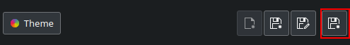
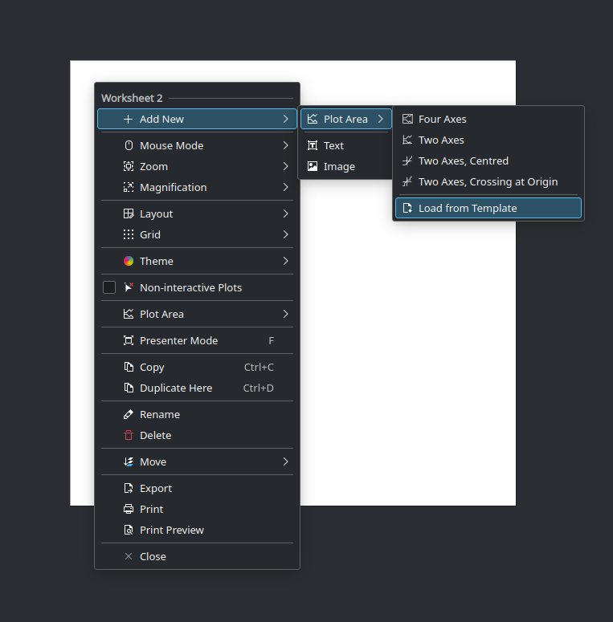

.. _themes_plot_templates:

Plot Area Templates
===================

Contrary to the object templates described above that save and load the properties for one object type only, ``plot templates``  do the same for the whole plot area including all its children. This is helpful for example if a certain definition of a plot area with multiple data ranges and axes, curves, labels, etc. is frequently used. Once the desired definition of the plot area is designed finally and saved as a template, a new plot area of such a new "type" is created with one single mouse click similarly to how other basic and predefined plot areas are created on the - :ref:`worksheet`.

To save the current plot definition as a new plot template, the button :guilabel:`Save current plot definition` in the themes and templates bar in the :ref:`interface_properties_explorer` for the plot area needs to be clicked and the name for the new template needs to be provided.

To create a new plot area having this definition, select :guilabel:``Load from template`` in the context menu (or in the toolbar):

