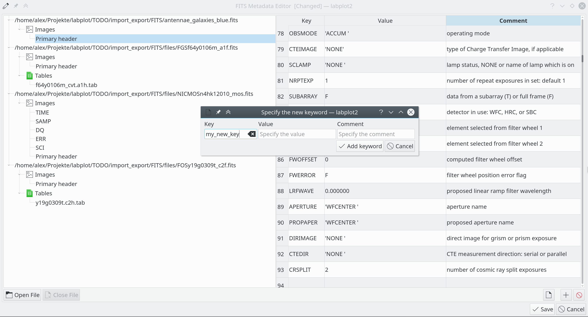

.. _tools_fits_editor:

FITS Metadata Editor
=====================

``FITS`` is an open standard file format widely used in the scientific community to store structured as well as unstructured multi-dimensional data. One of the major features of the FITS format is the ability to store the metadata in human-readable **headers**. Such headers are stored in the file, in addition to the actual data, as key-value pairs in the ASCII format and provide additional information about the origin of the data, its size, used measurement devices, etc. As described in more detail in the section :ref:`import_export_files`, LabPlot supports the import of data stored in the FITS format. In addition to that, LabPlot also provides the tool ``'FITS Metadata Editor`` that allows inspecting and modifying the metadata.

In general, a FITS file consists of one or more **Header + Data Units** (HDUs), where the first HDU is usually called the **primary HDU**. A FITS file can have any number of additional HDUs, commonly called FITS **extensions**. LabPlot's FITS Metadata Editor parses the metadata part of the selected FITS file only and shows all available headers (primary and extensional) in a tree view. Already existing key-value pairs can be modified or deleted, and new pairs can be added. It is also possible to open and edit more than one file at the same time.

FITS Metadata Editor with four opened files and a dialog for adding a new keyword:

