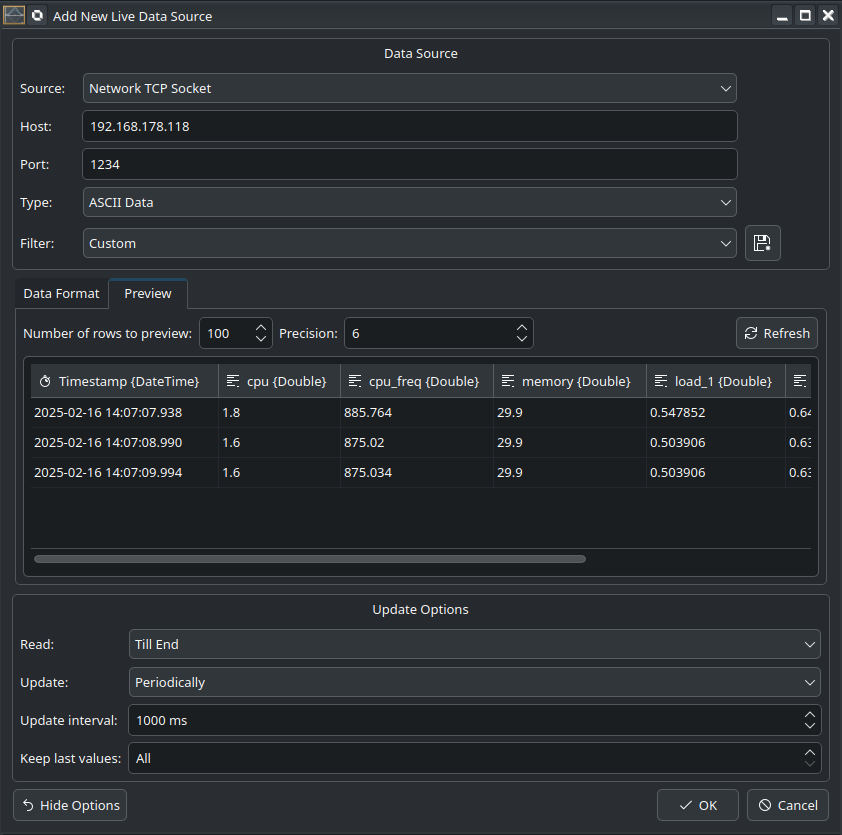

.. _tutorials_live_data_server_monitoring_via_tcp:

Server monitoring via TCP
================================

In this tutorial we will demonstrate how to monitor the system utilization on a remote host and to send the server metrics via TCP to the local host. On the local host, the data will be read and visualized in LabPlot.

To collect the relevant metrics and to send them via TCP, we utilize a Python script that is executed on the server and that opens a TCP socket for communication with external clients. This script is making use of the Python library `psutil <https://psutil.readthedocs.io/en/latest/>`_ to retrieve the various system metrics like the current load, etc.:

.. code-block:: python

    #!/usr/bin/python3

    import socket, psutil, time

    HOST = 'localhost'
    PORT = 1027
    serv = socket.socket(socket.AF_INET, socket.SOCK_STREAM)
    serv.setsockopt(socket.SOL_SOCKET, socket.SO_REUSEADDR, 1)

    # bind host and port together
    serv.bind((HOST,PORT))

    # configure how many clients the server can listen simultaneosly
    serv.listen(1)
    print ('listening ...')

    # accept new connections
    conn, addr = serv.accept()
    print("connection from: " + str(address))

    # send the current values for the server metrics
    while True:
        cpu = psutil.cpu_percent();
        cpu_freq = psutil.cpu_freq().current;
        mem = psutil.virtual_memory()
        load = psutil.getloadavg()
        message = str(cpu) + " " + str(cpu_freq) + " " + str(mem[2]) + " " +  str(load[0]) + " " + str(load[1]) + " " + str(load[2]) + "\n"
        try:
            conn.send(message.encode())

            # wait 1s before sending the next message
            time.sleep(1)
        except:
            conn.close()
            conn, addr = serv.accept()

In the example above, the current values for CPU utilization, CPU frequency, memory utilization and the average load for the last 1, 5 and 15 minutes are determined and transmitted to the connected client at one-second intervals.

After the script was started on the server, we proceed with the creation of a Live Data Source object in LabPlot running on the local computer and connect it to the TCP socket that has been opened on the server side:

We activated the "Create Timestamp" option to obtain the timestamp for each read message. This will allow us to use the timestamp on the x-axis later. We also specified the column names to clarify the meaning of the data columns, no need to provide a custom name for the automatically generated column "Timestamp".

New data is read at 1,000 milliseconds intervals. Depending on the requirements, this can be adjusted to a higher or lower value, as well as the time interval to send new data on the server side.

To verify that data is being correctly received, we switch to the preview tab:

After clicking "OK," the application will read the data from the TCP socket and we create line plots to visualize this data. On the screenshots below the final result is shown:

To use the entire monitor space, we open the worksheet in the presenter mode:

