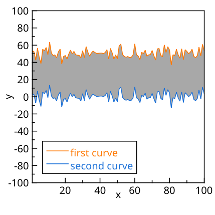

.. _tutorials_visualization_fill_area_between_curves  :

.. meta::
   :description: Tutorial on filling the area between curves in LabPlot
   :keywords: LabPlot, tutorial, curve, fill area, data visualization

Fill Area Between Curves
========================

In this tutorial we'll explore how to fill the area between two curves in LabPlot. It's not directly supported as a built-in feature yet, but with a few steps we can achieve the desired result, at least for simple cases as on the screenshot below:

To get this result, we'll use the feature "Fill Area Under Curve" to fill the area under each curve separately. This approach works well when the curves do not intersect each other, but it may not be suitable for more complex cases where the curves cross multiple times. In such cases, a more sophisticated method would be needed to accurately fill the area between the curves.

To achieve the result shown in the screenshot, we follow these steps:

#. Create a plot with two curves that you want to fill the area between.

#. For each curve, select under the properties for "Filling" for the direction the value "Below". This will fill the area under each curve separately.

#. Adjust the colors and transparency of the filled areas to visually distinguish them and create the effect of filling the area between the curves. Use for the lower curve the same color as for the background color of the plot area, so that the area between the curves appears to be filled with the color of the upper curve. The settings for both curves are shown on the screenshots below:

   .. figure:: images/tutorials_visualization_fill_area_between_curves_curve1.png
       :alt:
       :align: center

   .. figure:: images/tutorials_visualization_fill_area_between_curves_curve2.png
       :alt:
       :align: center

#. Deactivate the grid lines for axes since the filling is drawn on top of the grid lines and they would be visible in some of the areas that are not covered by the filled regions, which may not look good:

   .. figure:: images/tutorials_visualization_fill_area_between_curves_no_grid_lines.png
       :alt:
       :align: center
