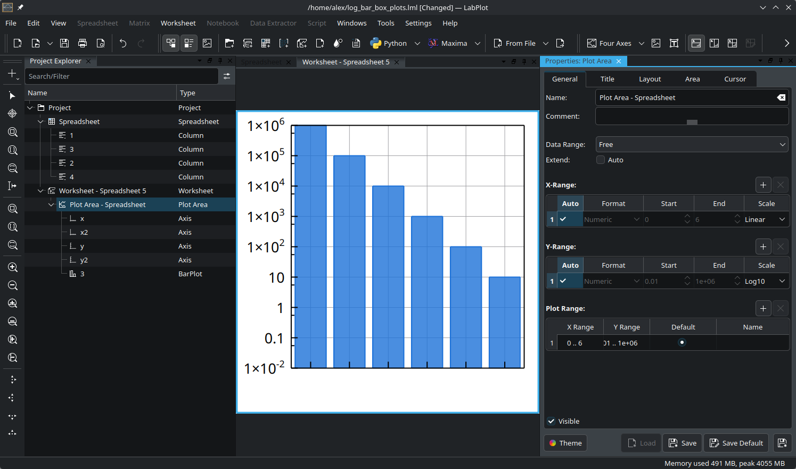

.. _tutorials_visualization_log_scale_bar_plots:

Log-Scale Bar Plots
====================

In this tutorial we'll explore when logarithmic (log) scales are appropriate for bar plots, how to pay attention to the baseline depending on your data and how to set it in LabPlot.

.. meta::
   :description: Tutorial on using logarithmic scales with bar plots, including when to use them and baseline considerations
   :keywords: LabPlot, tutorial, bar chart, bar plot, logarithmic scale, log scale, baseline, data visualization

When Should You Use Log-Scale Bar plots?
-----------------------------------------

Bar plots are typically used to visualize and compare absolute values. With **linear scaling**, a bar that is twice as tall represents exactly twice the value. However, there are specific situations where a **logarithmic scale** makes sense for bar plots:

1. **Plotting Ratios**: When your data represents ratios or fold-changes. Values above 1.0 represent increases, and values below 1.0 represent decreases.

2. **Plotting Growth Processes**: When visualizing exponential growth (e.g., cell numbers, population growth, bacterial cultures), a log scale makes sense because the number of doublings is proportional to the log of the quantity.

3. **Comparing Values Spanning Multiple Orders of Magnitude**: When your data contains very small and very large values (e.g., 0.001 to 1000), a log scale can show all values clearly without extremely tall bars.

.. important::

   **Caution**: Using log scales for regular count data (e.g., number of items, survey responses) is generally **not recommended**. The relative heights of bars become dependent on the arbitrary choice of baseline, which can mislead viewers.

The Baseline Problem on Log Scales
----------------------------------

The fundamental issue with bar plots on log scales is understanding where the bars start. Since there is no zero on a logarithmic axis, you must decide where to begin the bars. Common choices might be 1.0, 0.1, 0.01, 0.001, etc. This choice is somewhat arbitrary, and it affects how the bars appear visually. 

Setting the Correct Baseline
-----------------------------

.. important::

   In LabPlot, there is no dedicated "baseline" setting for bar plots on log scales. Rather, the start point of the plot range is used for this purpose.

After the bar plot is created:

- navigate to the settings of the plot area and switch to a logarithmic scale for the relevant axis
- uncheck the option "Auto" to be able to specify the start and the end points manually
- adjust the start of the range to the value that should be used as your desired baseline in the bar plot

For more information on configuring plot data ranges in LabPlot, see the :ref:`2D plotting <2D_plotting>` documentation.
