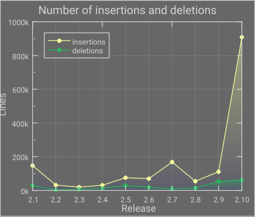
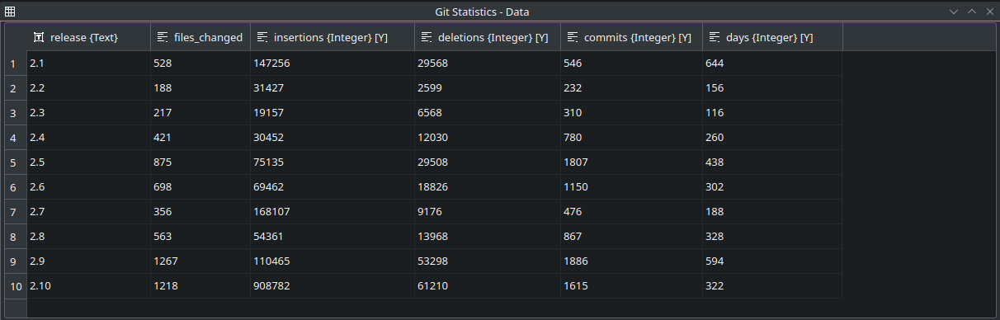
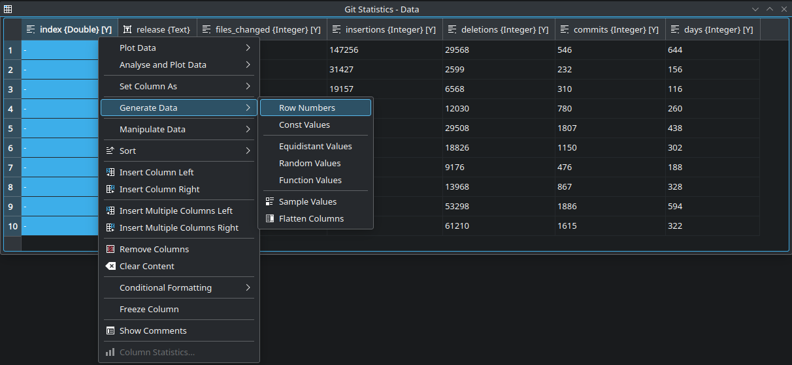
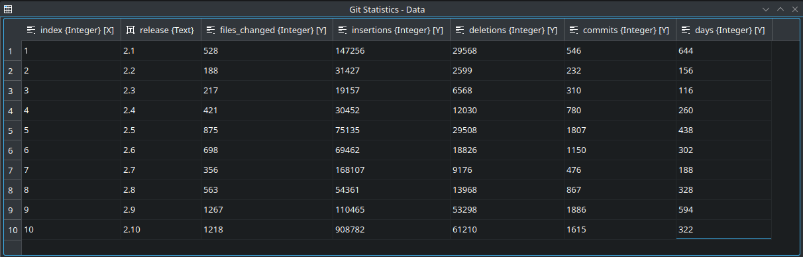
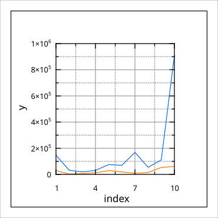
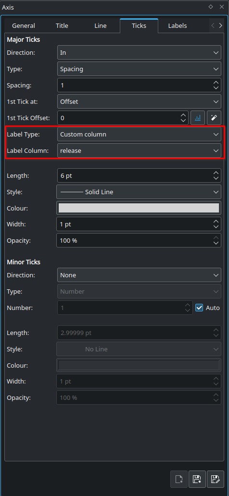

.. _tutorials_visualization_plot_text_data:

Plot Text Data
================================

In this tutorial we'll show how to plot text data and how to create visualizations like on the plot shown below with numerical data on the y-axis and text data on the x-axis that is stemming from a text column in a spreadsheet:

This example and the data is taken from the example project "SLOC History" that can be found in the collection of `example projects <https://labplot.org/2022/05/26/example-projects/>`_  that are part of LabPlot's installation. More background for the data visualized in that example project can be found in the `blog post <https://labplot.org/2019/11/05/sloccount-git-history-of-labplot/>`_.

Let's start with the data:

Here we have one text column containing the strings representing LabPlot's release versions as well as multiple numerical columns.

To plot the text data in LabPlot we need to add an index column first. For this, we add a new column and fill it with row numbers:

Set the plot designation to X for the new column so it's properly recognized in the "Plot Data"-dialog in the spreadsheet:

Now we can plot the numerical values against this index column as usual:

The data is properly plotted now and we only need to show a tick on the axis for every single value and to the text data in the axis labels. For this, select the x-axis and navigate in the Properties Explorer to the tab "Ticks". Specify the spacing 1 for axis ticks and use "Custom Column" for the label type and specify the column "release" from the spreadsheet as the label column:

With this, LabPlot will use the string values from the spreadsheet column to label the axis ticks.

Apply additional formatting, rename the axis title labels and add the legend to get the final result as shown above. 