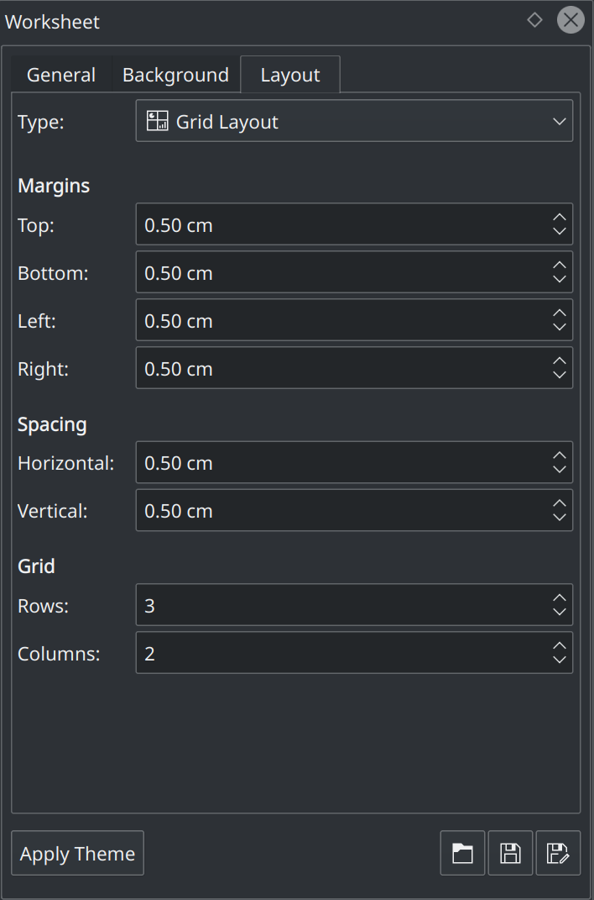
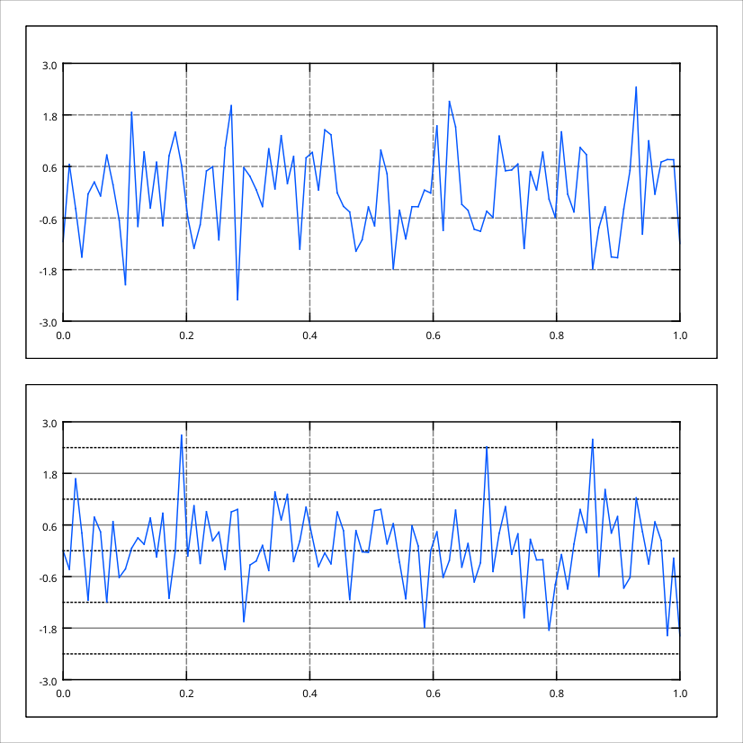
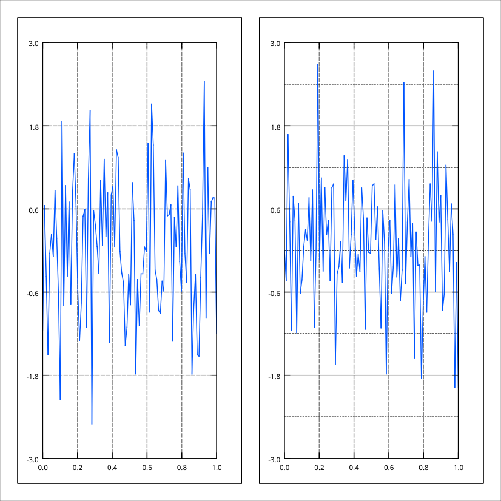
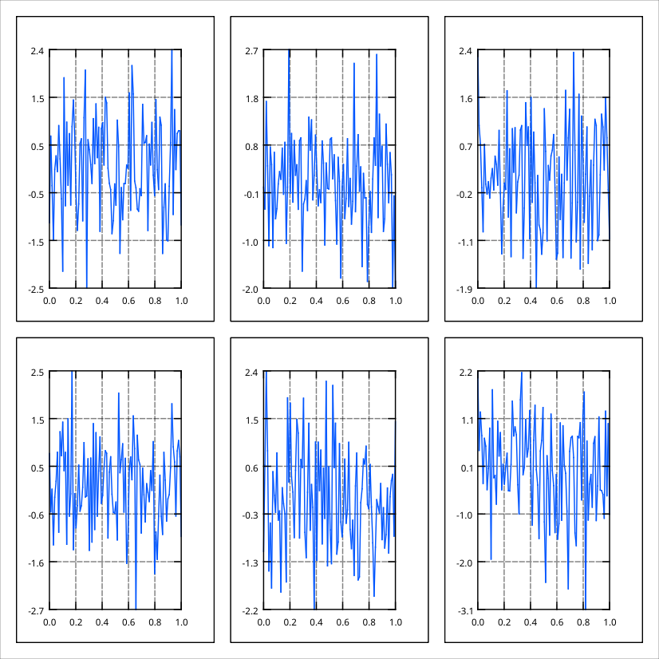
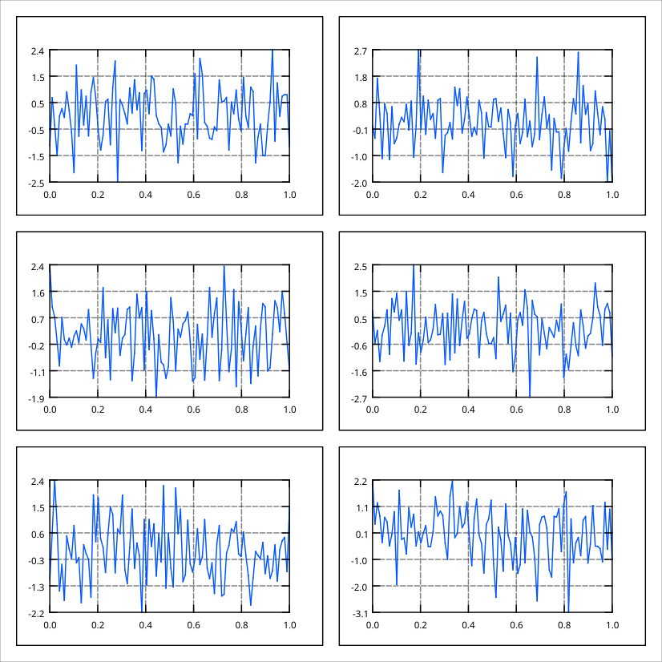
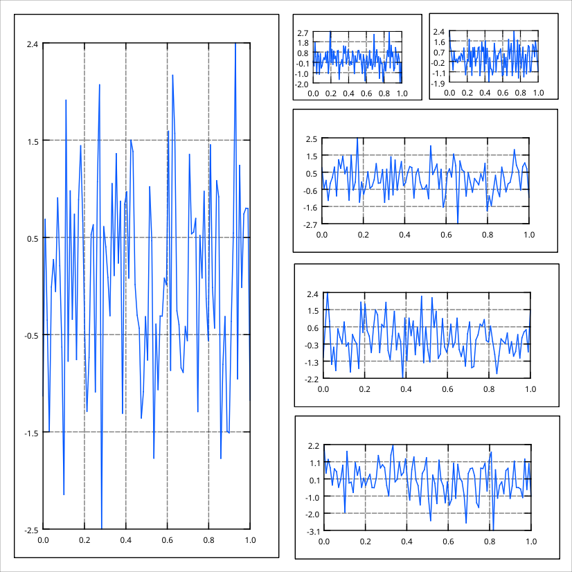

.. _worksheet_layouts:

Layouts
===================

.. contents::

Though the positioning of the objects on the worksheet can be freely done, a more practical and comfortable way to do this is by using the layouting system of the worksheet. If the layout is active, the plots are automatically arranged according to the type of the layout, s.a. the examples below. The layout of the currently selected worksheet is activated (or deactivated) via the corresponding buttons in the main toolbar:

or via the context menu of the worksheet.

Three different layout types are supported - vertical, horizontal and grid layout. In case no layout has to be used and the positioning is done manually by the user, the type "No Layout" has to be selected.

The properties of the layout are modified in the tab "Layout" in the properties explorer:

Here it is possible to specify the sizes of the margins as well as of the spacing between the plots. The type of the layout can also be changed here. In case the grid layout is active, additional options for the number of rows and columns in the grid that are specific to this layout type.

When adding new plots to the worksheet, LabPlot automatically takes care of the re-calculation of the sizes and positions for all plots on the worksheet according to the specified layout properties like type, margins and spacing.

Vertical Layout
~~~~~~~~~~~~~~~~~~~~~

The vertical layout arranges the plots in the vertical direction:

Horizontal Layout
~~~~~~~~~~~~~~~~~~~~~

The horizontal layout arranges the plots in the horizontal direction:

Grid Layout
~~~~~~~~~~~~~~~~~~~~~

In the grid layout the plots are arranged in multiple columns and rows. The number of columns and rows can be modified by the user. In the example below six plots are arranged in two rows and three columns:

The same plots can also be arranged in three rows and two columns:

Note how the sizes of the plots are automatically adjusted to fit to the fixed size of the worksheet.

Advanced Layout
~~~~~~~~~~~~~~~~~~~~~

More advanced layouts with arbitrary positions and sizes of the plots are achieved by deactivating the automatic layouting in the worksheet (option "No Layout") and by setting the positions and sizes manually. Below is an example for such an arrangement of plots:

